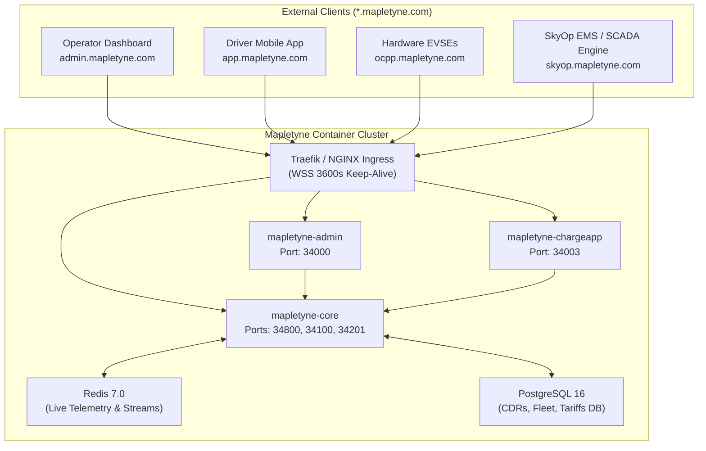

# Mapletyne CPO Platform

> The Enterprise Charge Point Operator (CPO) and Fleet Energy Management System.

Mapletyne CPO provides an end-to-end, cloud-native platform for managing electric vehicle charging networks, depot fleets, smart charging, and OCPI roaming.

---

## The Core Workloads

| Component | Role | Runtime & Stack | Port(s) |
| :--- | :--- | :--- | :--- |
| **`mapletyne-admin`** | Operator Mission Control Dashboard | React 18, Vite, Tailwind CSS, NGINX | `34000` (internal `8080`) |
| **`mapletyne-chargeapp`** | Driver Mobile PWA & Receipts | FastAPI, Jinja2, HTMX, Tailwind | `34003` (internal `8003`) |
| **`mapletyne-core`** | CSMS Backend & Management API | Python 3.12, asyncpg, Redis, Uvicorn | `34800` (API), `34100` (WS 1.6), `34201` (WS 2.0.1) |

---

## Architecture Topology



---

## Quick Start (Replicable Deployment)

Run the entire suite with pre-built multi-arch images directly from GitHub Container Registry (`ghcr.io`):

```bash
# 1. Download production compose file
curl -O https://raw.githubusercontent.com/danielmtt9/mapletyne-cpo/main/docker-compose.prod.yml

# 2. Pull prebuilt containers from GHCR
docker compose -f docker-compose.prod.yml pull

# 3. Start all services
docker compose -f docker-compose.prod.yml up -d
```

### Access Points
- 🖥️ **Operator Dashboard**: [http://localhost:34000](http://localhost:34000)
- 📱 **Driver Mobile PWA**: [http://localhost:34003](http://localhost:34003)
- 🔌 **Core REST API & Prometheus Telemetry**: [http://localhost:34800/metrics](http://localhost:34800/metrics)
- ⚡ **OCPP 1.6 WebSocket**: `ws://localhost:34100/{ChargePointId}`
- ⚡ **OCPP 2.0.1 WebSocket**: `ws://localhost:34201/{ChargePointId}`

---

## Key Capabilities

1. **Protocol & Hardware Telemetry**: Full OCPP 1.6J and OCPP 2.0.1 compliance with device model diagnostics, active 3-phase oscilloscope, and automated self-healing watchdog routines.
2. **Depot Fleet Cockpit & Dispatching**: Bay-level smart charging, vehicle SoC tracking, departure scheduling, and dynamic grid headroom management.
3. **External EMS / SCADA Interoperability**: Bi-directional control endpoints enabling external energy management engines (e.g. SkyOp EMS) to enforce dynamic site power limits and grid flexibility curtailment.
4. **Hardened Container Security**: Multi-stage unprivileged builds, non-root user execution (`USER 10001:10001` / `USER 101:101`), `no-new-privileges`, `cap_drop: [ALL]`, automated log rotation (`50m`/5 files), and graceful WebSocket session draining.

---

## Documentation

Full architectural specifications and guides are located in [`docs/mapletyne_deployment_and_containerization_plan/`](./docs/mapletyne_deployment_and_containerization_plan/):
- [`01_SYSTEM_ARCHITECTURE.md`](./docs/mapletyne_deployment_and_containerization_plan/01_SYSTEM_ARCHITECTURE.md)
- [`02_UI_UX_AND_DEEP_DIVE_STANDARDS.md`](./docs/mapletyne_deployment_and_containerization_plan/02_UI_UX_AND_DEEP_DIVE_STANDARDS.md)
- [`03_DOCKER_CONTAINERIZATION_SPEC.md`](./docs/mapletyne_deployment_and_containerization_plan/03_DOCKER_CONTAINERIZATION_SPEC.md)
- [`04_KUBERNETES_AND_HELM_SPEC.md`](./docs/mapletyne_deployment_and_containerization_plan/04_KUBERNETES_AND_HELM_SPEC.md)
- [`05_MANAGEMENT_API_INVENTORY_UPDATE.md`](./docs/mapletyne_deployment_and_containerization_plan/05_MANAGEMENT_API_INVENTORY_UPDATE.md)
- [`06_GHCR_AND_REPLICABILITY_GUIDE.md`](./docs/mapletyne_deployment_and_containerization_plan/06_GHCR_AND_REPLICABILITY_GUIDE.md)
- [`07_DATABASE_TENANCY_AND_NAMING_SPEC.md`](./docs/mapletyne_deployment_and_containerization_plan/07_DATABASE_TENANCY_AND_NAMING_SPEC.md)
- [`08_PROVISIONING_PARAMETERS_AND_FORMATS.md`](./docs/mapletyne_deployment_and_containerization_plan/08_PROVISIONING_PARAMETERS_AND_FORMATS.md)

---

## License

Copyright © 2026 Mapletyne Technologies. All rights reserved.

