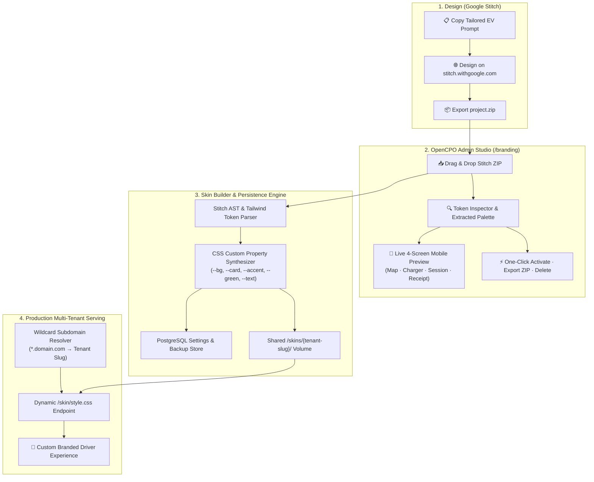

# OpenCPO White-Label Branding Studio & Google Stitch Production Plan

Complete technical specification for the white-label **Branding Studio** inside OpenCPO Admin Dashboard (`opencpo-admin`) and Driver PWA (`opencpo-charge-app`), customized for production deployments.

---

## 1. Aligned Architecture Decisions

1. **Full-Platform White-Labeling**:
   - Driver PWA (`opencpo-charge-app`), Admin Dashboard branding/header, receipts, emails, and PWA manifests adapt to the active tenant brand.
2. **Hybrid PostgreSQL + Shared Volume Storage**:
   - Skin metadata, tokens, and active branding configuration stored in PostgreSQL (`pricing_config` / `settings`) for automated backups via `./scripts/db-utils.sh`.
   - CSS themes (`style.css`), logos (`logo.svg`), favicons (`favicon.svg`), and metadata (`skin.json`) written to shared `skins/` volume mounted into both `cpo-admin` and `charge-app` for zero-rebuild live serving.
3. **Wildcard Subdomain Multi-Tenancy**:
   - `opencpo-charge-app` dynamically resolves `<tenant-slug>.yourdomain.com` (e.g. `acme.charge.mapletyne.com` → `acme`) directly to the corresponding skin directory in real-time, falling back to the configured master brand.
4. **Google Stitch ZIP Import Engine**:
   - Integrated Stitch Prompt Generator tailored to EV charging with realistic metrics (kW, kWh, €/kWh, BTW%).
   - Direct drag-and-drop `.zip` upload converter powered by the AST and Tailwind token extractor in `opencpo-charge-app/tools/stitch-to-skin.py`.
5. **Full Skin Control Suite**:
   - Interactive 4-screen live preview (Map Screen, Charger Detail, Live Session with battery SoC gauge, Digital Receipt).
   - Design token inspector (colors, font stacks, dark/light mode).
   - One-click global activation, ZIP export download, and skin deletion.

---

## 2. System Flow Diagram



---

## 3. Detailed Component Specification

### Component 1: Skin Converter & Database Service (`opencpo-admin/services/skin_builder.py`)
- **`import_stitch_zip(zip_bytes, custom_name, custom_slug) -> dict`**:
  - Unpacks Stitch ZIP in temporary memory.
  - Extracts embedded Tailwind configs and HTML tokens (colors, font families, border-radii).
  - Synthesizes `skin.json` and a complete `style.css` mapped to OpenCPO classes and CSS custom properties (`--bg`, `--bg2`, `--card`, `--border`, `--accent`, `--green`, `--red`, `--text`, `--text2`, `--font-headline`, `--font-body`, `--font-mono`).
  - Extracts logos/icons if present, or provides standard SVG fallbacks.
  - Writes to `/app/skins/<slug>/`.
  - Records metadata and token snapshot into PostgreSQL `ocpp.pricing_config` table.
- **`list_all_skins() -> list[dict]`**:
  - Scans `skins/` directory, combines with PostgreSQL metadata, returns full token snapshots, preview image lists, and active status.
- **`activate_global_skin(slug) -> bool`**:
  - Sets active master skin in PostgreSQL and writes to `opencpo-charge-app/.env`.
- **`delete_skin(slug) -> bool`**:
  - Safely deletes custom skin folder (protecting default skins).
- **`export_skin_zip(slug) -> bytes`**:
  - Creates downloadable `.zip` package of the skin directory.

### Component 2: Branding Studio Routes (`opencpo-admin/routes/branding.py`)
- `GET /branding`: Serves the Branding Studio UI with all installed skins, token inspector data, and active domain settings.
- `POST /branding/upload-stitch`: Multipart upload handler for Google Stitch ZIP files.
- `POST /branding/stitch-prompt`: Returns customizable Stitch prompt template.
- `POST /branding/activate/{slug}`: Sets active global skin.
- `DELETE /branding/skin/{slug}`: Removes a custom skin.
- `GET /branding/export/{slug}`: Downloads skin ZIP archive.

### Component 3: Branding Studio UI (`opencpo-admin/templates/branding.html`)
- **Google Stitch Workflow Hub**:
  - 1-Click Stitch Prompt Builder: Customized for the brand name, language (Dutch/English/German/French), currency, and optional primary color hint.
  - Quick link out to `stitch.withgoogle.com`.
  - Drag-and-drop ZIP dropzone with instant upload progress and validation.
- **Interactive 4-Screen Mobile Preview (390px)**:
  - Interactive tabs:
    1. **Map View**: Branded pins, search bar, active filter badges.
    2. **Charger Detail**: Connector card (CCS2), real-time kW rating, pricing badge, "Start Charge" button.
    3. **Live Charging Session**: Circular SoC battery level gauge, live kW delivery counter, session cost, stop button.
    4. **Digital Receipt**: Energy delivered, tariff breakdown (including BTW tax), PDF receipt download button.
  - CSS Variable live injection so operators can test the exact visual look immediately.
- **Design Token Inspector**:
  - Shows extracted primary/secondary/background/card/border hex values, font stacks, and light/dark mode tag.
- **Skin Fleet Management Grid**:
  - Cards for each installed skin displaying preview thumbnails, active badge, activation button, export ZIP button, and delete button.

### Component 4: Dynamic Subdomain Middleware (`opencpo-charge-app`)
- **`opencpo-charge-app/core/middleware.py`**:
  - Extracts hostname from `request.headers.get("host")` (e.g. `clienta.charge.example.com`).
  - Resolves subdomain slug `clienta`:
    - If `skins/clienta/` exists, sets `request.state.skin = "clienta"`.
    - Otherwise falls back to `config.SKIN` / `default`.
- **`opencpo-charge-app/main.py`**:
  - Dynamic `/skin/{filename:path}` endpoint serving CSS, logo, and favicon dynamically per request host.

### Component 5: Docker Volume Mounting (`docker-compose.yml`)
- Update `cpo-admin` and `charge-app` services:
  ```yaml
  volumes:
    - ./opencpo-charge-app/skins:/app/skins:rw
  ```
- Ensures instant sync across containers without rebuilds or restarts.

---

## 4. Verification Plan

1. **Stitch ZIP Converter Unit Test**:
   - Run converter on sample Stitch export and verify `skin.json` + `style.css` generation.
2. **Wildcard Host Resolution Test**:
   - Send requests with `Host: volt.charge.domain.com` vs `Host: default.charge.domain.com` and verify dynamic CSS delivery.
3. **Admin Studio UI Test**:
   - Upload Stitch ZIP in `/branding`, test 4 preview screens, activate skin, and verify persistence in PostgreSQL.
