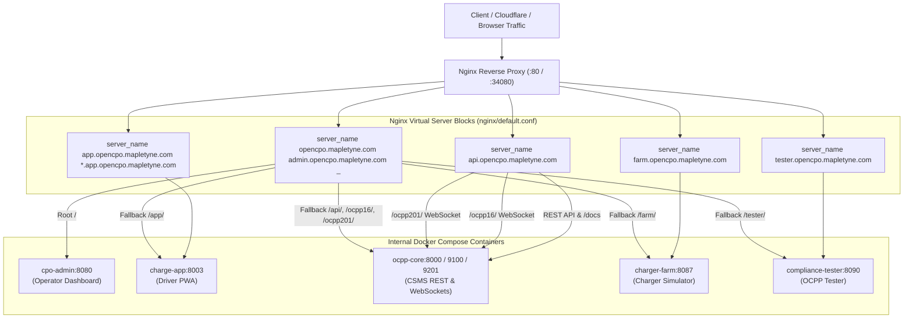

# OpenCPO Nginx Subdomain Routing & Multi-Host Architecture Plan

Detailed plan to configure production Nginx reverse proxy server blocks for nested subdomains under `*.opencpo.mapletyne.com` while maintaining dual-mode fallback routing on `opencpo.mapletyne.com`.

---

## 1. Subdomain Architecture Specification

| Subdomain | Target Service | Internal Port | Description & Protocols |
| :--- | :--- | :--- | :--- |
| **`opencpo.mapletyne.com`** / **`admin.opencpo.mapletyne.com`** | `cpo-admin` | `:8080` | Operator Dashboard UI + Full Hybrid Path Fallback (`/app/`, `/farm/`, `/tester/`, `/api/`, `/ocpp16/`, `/ocpp201/`) |
| **`app.opencpo.mapletyne.com`** (and `*.app.opencpo.mapletyne.com`) | `charge-app` | `:8003` | Driver PWA App (supports tenant white-label skin routing) |
| **`api.opencpo.mapletyne.com`** | `ocpp-core` | `:8000` (REST), `:9100` (OCPP 1.6), `:9201` (OCPP 2.0.1) | Core CSMS REST API, OpenAPI docs at `/docs`, and WebSocket endpoints (`/ocpp16/`, `/ocpp201/`) |
| **`farm.opencpo.mapletyne.com`** | `charger-farm` | `:8087` | Virtual Charger Simulator Dashboard & WebSocket simulation |
| **`tester.opencpo.mapletyne.com`** | `compliance-tester` | `:8090` | OCPP Compliance & Certification Test Harness |

---

## 2. Nginx Server Blocks Architecture



---

## 3. Implementation Steps

### Step 1: Update `nginx/default.conf`
- Configure 5 dedicated `server` blocks matching each subdomain.
- Enable WebSocket upgrade headers (`$http_upgrade`, `$connection_upgrade`) across all blocks.
- Configure default catch-all / `opencpo.mapletyne.com` block with hybrid fallback path routing.

### Step 2: Update `.env` Configuration
- Update service URLs:
  ```ini
  PUBLIC_URL=https://opencpo.mapletyne.com
  CHARGE_APP_URL=https://app.opencpo.mapletyne.com
  CHARGER_FARM_URL=https://farm.opencpo.mapletyne.com
  COMPLIANCE_URL=https://tester.opencpo.mapletyne.com
  CORE_API_PUBLIC_URL=https://api.opencpo.mapletyne.com
  ```

### Step 3: Rebuild & Reload Nginx Container
- Reload Nginx configuration (`nginx -s reload` or `docker compose restart nginx`).

### Step 4: Verification
- Verify HTTP & WebSocket requests across all virtual server blocks using simulated `Host:` headers:
  - `Host: opencpo.mapletyne.com` -> Admin Dashboard (HTTP 200)
  - `Host: app.opencpo.mapletyne.com` -> Driver App (HTTP 200)
  - `Host: api.opencpo.mapletyne.com` -> Core CSMS API / docs (HTTP 200)
  - `Host: farm.opencpo.mapletyne.com` -> Charger Farm (HTTP 200)
  - `Host: tester.opencpo.mapletyne.com` -> Compliance Tester (HTTP 200)
  - `Host: opencpo.mapletyne.com` with `/app/`, `/farm/`, `/tester/`, `/api/` -> Hybrid fallback (HTTP 200)
