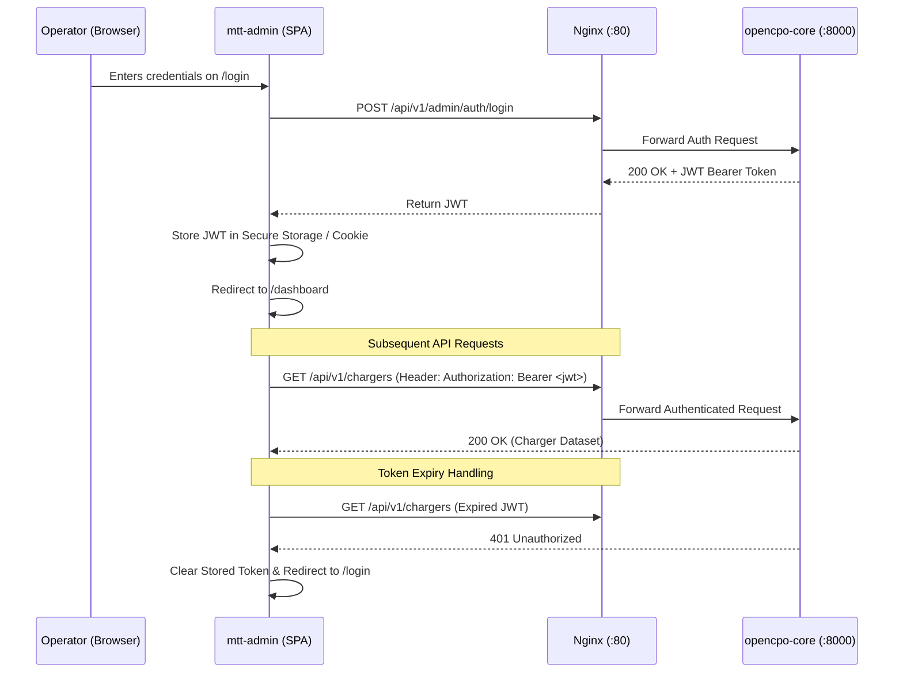

# Architecture Spine: OpenCPO Enterprise Suite (`mtt-admin`)

---

## 1. Architectural Paradigm & System Overview

* **Paradigm:** **Event-Driven Headless Client with Reactive State Invalidation (Event-Driven SPA)**
* **Target:** High-density, real-time Charge Point Operator (CPO) management suite.
* **Core Contract:** Complete architectural decoupling between the presentation layer (`mtt-admin`) and the OCPP/CSMS backend (`opencpo-core`). The client is delivered as a zero-runtime-overhead static bundle served by Nginx, binding strictly to OpenAPI 3.0 REST endpoints and Server-Sent Event (SSE) streams.

```
┌─────────────────────────────────────────────────────────────────────────────────┐
│                        mtt-admin Architecture Spine                             │
├─────────────────────────┬───────────────────────────────────────────────────────┤
│ Build & Runtime Target  │ Vite + React 19 / Next.js 15 (Static Export)          │
│ Type Safety Pipeline    │ openapi-typescript (Automated from /openapi.json)     │
│ UI Primitive System     │ shadcn/ui + Radix UI + Tailwind CSS v4 (rounded-0)    │
│ Server State & Cache    │ TanStack Query v5 + EventSource Invalidation          │
│ High-Density Tables     │ TanStack Table v8 + TanStack Virtual (40px rows)      │
│ Ingress & Gateway       │ Nginx Single-Domain Reverse Proxy                     │
└─────────────────────────┴───────────────────────────────────────────────────────┘
```

---

## 2. Invariant Architectural Decisions (ADs)

### `AD-1` [ADOPTED] Headless Decoupling via Single-Domain Reverse Proxy
* **Binds:** All client-to-core communication must route through unified Nginx reverse-proxy paths (`/api/v1/` for REST, `/api/v1/events/stream` for SSE, `/` for `mtt-admin` SPA).
* **Prevents:** Cross-Origin Resource Sharing (CORS) complexity, separate subdomain SSL certificate management, and leaky backend ports.
* **Rule:** `mtt-admin` must never hardcode absolute backend hostnames; all API calls use relative paths (`/api/v1/...`).

### `AD-2` [ADOPTED] 100% Strict Type Safety via OpenAPI Compilation
* **Binds:** All TypeScript models, request bodies, and response types in `mtt-admin` must derive directly from OpenCPO Core's `/openapi.json` via `openapi-typescript`.
* **Prevents:** Drift between backend Pydantic models and frontend interfaces; silent runtime `undefined` / `None` errors.
* **Rule:** Hand-written TypeScript interface definitions for API payloads are strictly forbidden. All schemas live in `src/lib/types/api.ts` generated by `npm run codegen`.

### `AD-3` [ADOPTED] Reactive Cache Invalidation over Polling
* **Binds:** Real-time UI updates (charging status, active kW, session duration) must be driven by Server-Sent Events (`/api/v1/events/stream`) invalidating TanStack Query cache keys.
* **Prevents:** High database query loads and battery drain caused by high-frequency client polling intervals.
* **Rule:** HTTP polling intervals (`refetchInterval`) are prohibited for charger states. The `useLiveEvents` hook listens to SSE events (`charger.status`, `meter.values`) and triggers targeted `queryClient.invalidateQueries(['chargers'])`.

### `AD-4` [ASSUMPTION] Static Bundle Substrate over Node.js SSR Server
* **Binds:** `mtt-admin` is built as an optimized static Single Page Application (`dist/` or `out/`) served directly by the Nginx container.
* **Prevents:** 150MB+ Node.js container memory overhead, Node process crashes, and SSR cold-start latency.
* **Rule:** No server-side Node.js runtime is deployed in production. Dynamic data is fetched client-side via authenticated REST/SSE.

### `AD-5` [ADOPTED] Industrial Intelligence Design Token Geometry (0px Sharp)
* **Binds:** All UI components (buttons, input fields, badges, cards, modals, sheets) must enforce 0px border radius (`rounded-none`).
* **Prevents:** Visual inconsistency, consumer-app aesthetic leakage, and soft UI elements in a mission-control industrial dashboard.
* **Rule:** Global CSS enforces `border-radius: 0px !important` on all interactive primitives.

### `AD-6` [ADOPTED] Virtualized DOM Rendering for Data Ledgers
* **Binds:** Any table exceeding 100 records (Sessions & Billing, Raw Meter Telemetry, Event Logs) must be rendered using `@tanstack/react-virtual`.
* **Prevents:** DOM bloat, memory leaks, and UI frame drops during large-scale network audits.
* **Rule:** Table row height is locked at **40px**, and the virtualizer only mounts rows visible in the viewport plus a 5-item overscan buffer.

### `AD-7` [ADOPTED] Tokenized CSS Variable Theming for White-Labeling
* **Binds:** Dynamic brand customization (logos, company name, primary `#10b981`, accent `#48e260`, background `#0b1326`) is driven through runtime CSS Custom Properties injected into `:root`.
* **Prevents:** Requiring code rebuilds or Docker image redeployments to apply white-label branding changes.
* **Rule:** The `ThemeProvider` reads branding from `GET /api/v1/settings` (cached in LocalStorage) and writes directly to `document.documentElement.style`.

### `AD-8` [ADOPTED] Optimistic Mutation Feedback on Remote Operations
* **Binds:** Remote charger actions (`RemoteStart`, `RemoteStop`, `SoftReset`, `UnlockConnector`) must immediately show visual loading/pending states with optimistic feedback (< 250ms).
* **Prevents:** Operator confusion and accidental duplicate button clicks during OCPP network latency.
* **Rule:** Remote command buttons immediately disable, display a spinner, and trigger a toast notification upon receiving the OCPP response.

### `AD-9` [ADOPTED] Reactive White-Label Visual Identity Injection
* **Binds:** `mtt-admin` theme provider and mobile charge screens.
* **Prevents:** Jarring full-page reloads and inconsistent theme states across navigation tabs.
* **Rule:** Changes to brand colors (`primary_color`, `secondary_color`, `accent_color`) MUST dynamically recalculate and inject CSS custom properties (`--color-primary`, etc.) directly into the DOM `:root` upon save, triggering immediate visual synchronization.

### `AD-10` [ADOPTED] Legal, Tax & Multi-Currency Billing Authority Invariant
* **Binds:** Invoicing, CDR calculations, receipt generation, and OCPI tariff settlements.
* **Prevents:** Non-compliant financial records and missing VAT/Tax attribution on customer billing receipts.
* **Rule:** The `organization` setting profile acts as the sole legal and financial authority, supplying trading name, registered legal entity, Tax/VAT ID, registration number, physical multi-line address, and base ISO operating currency for all billing operations.

### `AD-11` [ADOPTED] Keycloak Unified Identity & Access Management (IAM) Invariant
* **Binds:** User identity, token issuance, credential verification, RBAC route guards across all UI portals and REST APIs.
* **Prevents:** Decentralized password storage, hardcoded roles, fragmented driver/operator auth silos, and session fixation vulnerabilities.
* **Rule:** Keycloak 26 is co-located in Docker Compose, connected to PostgreSQL `keycloak` database, and routed via NGINX under `/auth/` and `auth.opencpo.mapletyne.com`. The landing page authenticates via Direct Access Grants against Keycloak `/protocol/openid-connect/token` via `/api/v1/admin/auth/login`, preserving the dark glassmorphic landing page styling without full-page browser redirects. `opencpo-core` validates RS256 JWTs using cached JWKS public keys. Dual-channel authentication is preserved (`X-API-Key` for M2M, Bearer token for users). Roles (`cpo-admin`, `site-operator`, `billing-manager`, `fleet-manager`, `driver`) are mapped to frontend navigation and backend route guards.

### `AD-12` [ADOPTED] Two-Step Verification & SMTP Self-Registration Invariant
* **Binds:** User onboarding, email ownership proof, Keycloak user creation, and role assignment.
* **Prevents:** Spam registrations, unverified email accounts, identity spoofing, and broken external registration redirects.
* **Rule:** Self-service registration requires submitting credentials (Step 1) followed by verifying a 6-digit email OTP code (Step 2) before Keycloak account provisioning. Verification codes MUST be dispatched via the system's configured SMTP settings (`ocpp.settings` `smtp` record) with a dark-branded HTML email template. Pending registration state and verification codes MUST be stored in Redis with an explicit 600-second (10-minute) TTL and a 5-attempt rate limit. `opencpo-core` provisions users in Keycloak via Admin REST API (`POST /admin/realms/opencpo/users`) with `emailVerified: true` and attaches the requested realm role (`driver`, `site-operator`, `fleet-manager`). Successful verification automatically executes Direct Access Grant token exchange, returning RS256 `access_token` and `refresh_token` for instant auto-login.

---

## 3. Component Hierarchy & Dependency Flow

```
┌─────────────────────────────────────────────────────────────────────────────────┐
│                           mtt-admin Presentation Layer                          │
│  • App Shell (Sidebar, Header, Cmd+K Palette, Live SSE Status Dot)              │
│  • Page Views (Overview, Chargers, Sessions, Tariffs, Fleet, PKI, EMS, Settings)│
│  • Modals & Sheets (ChargerDetailDrawer, ProvisionModal, BrandStudio)           │
└────────────────────────────────────────┬────────────────────────────────────────┘
                                         │ Consumes Hooks & State
                                         ▼
┌─────────────────────────────────────────────────────────────────────────────────┐
│                      State & Data Synchronization Layer                         │
│  • TanStack Query v5 (Cache Store, Garbage Collection, Query Keys)             │
│  • SSE EventSource Hook (Subscribes to /api/v1/events/stream)                   │
│  • ThemeProvider (Injects :root CSS Custom Properties)                         │
└────────────────────────────────────────┬────────────────────────────────────────┘
                                         │ Uses Typed Fetch Client
                                         ▼
┌─────────────────────────────────────────────────────────────────────────────────┐
│                        API Client & OpenAPI Type Layer                          │
│  • openapi-fetch Client with JWT Interceptor (src/lib/api-client.ts)            │
│  • Strict Generated TypeScript Schemas (src/lib/types/api.ts)                   │
└────────────────────────────────────────┬────────────────────────────────────────┘
                                         │ HTTP REST & SSE Streams
                                         ▼
┌─────────────────────────────────────────────────────────────────────────────────┐
│                           Nginx Gateway (Port 80/443)                           │
│  • /            → Static mtt-admin SPA (HTML / JS / CSS)                        │
│  • /api/v1/     → opencpo-core:8000 (FastAPI REST Engine)                       │
│  • /app/        → opencpo-charge-app:8001 (Driver Mobile PWA)                   │
│  • /ocpp16|201/ → opencpo-core WebSocket Server                                 │
└─────────────────────────────────────────────────────────────────────────────────┘
```

---

## 4. Cache Keys & Query Contract (TanStack Query)

To guarantee predictable data synchronization across all views, query keys are standardized:

| Query Key Schema | Associated Endpoint | Invalidation Trigger |
| :--- | :--- | :--- |
| `['chargers', { status, site }]` | `GET /api/v1/chargers` | SSE `charger.status`, Provision, Delete |
| `['charger', cp_id]` | `GET /api/v1/chargers/{cp_id}` | SSE `charger.status`, Remote Commands |
| `['telemetry', cp_id]` | `GET /api/v1/chargers/{cp_id}/meter-values` | SSE `meter.values` |
| `['sessions', { page, from, to }]` | `GET /api/v1/sessions` | SSE `session.started`, `session.stopped`|
| `['sessions', 'stats', 'today']` | `GET /api/v1/sessions/stats/today` | SSE `session.stopped`, `meter.values` |
| `['tariffs']` | `GET /api/v1/tariffs` | Tariff Create, Update, Delete |
| `['pricing', 'current']` | `GET /api/v1/pricing/current` | Hourly spot price tick |
| `['tokens']` | `GET /api/v1/tokens` | Token Create, Block, Unblock |
| `['pki', 'stats']` | `GET /api/v1/pki/stats` | CSR Signed, Cert Revoked |
| `['ems', 'live', site_id]` | `GET /api/v1/ems/live` | SSE `ems.telemetry` |
| `['settings']` | `GET /api/v1/settings` | Settings / Branding Save |

---

## 5. Security & Authentication Blueprint



---

## 6. Deployment & Docker Integration

### Multi-Stage Dockerfile (`mtt-admin/Dockerfile`)
```dockerfile
# Stage 1: Build Static SPA Bundle
FROM node:20-alpine AS builder
WORKDIR /app
COPY package*.json ./
RUN npm ci
COPY . .
RUN npm run build

# Stage 2: Serve via Nginx
FROM nginx:alpine
COPY --from=builder /app/dist /usr/share/nginx/html/mtt-admin
COPY nginx.conf /etc/nginx/conf.d/default.conf
EXPOSE 80
CMD ["nginx", "-g", "daemon off;"]
```

### Docker Compose Service Definition (`docker-compose.yml`)
```yaml
  mtt-admin:
    build:
      context: ./mtt-admin
      dockerfile: Dockerfile
    container_name: opencpo-mtt-admin
    restart: unless-stopped
    ports:
      - "80:80"
    depends_on:
      - ocpp-core
    networks:
      - opencpo-net
```

---

## 7. Deferred Items & Future Horizons

The following capabilities are deliberately **deferred** from the initial architecture spine to prevent premature abstraction:
1. **Offline PWA Support for Admin:** While the Driver App requires offline caching, the Admin suite requires live connection to the CSMS and is treated as an online-first desktop tool.
2. **GraphQL Gateway:** REST + OpenAPI + SSE covers 100% of functional requirements with zero added complexity. GraphQL is deferred until third-party public API partner integrations demand it.
3. **WebSockets for Admin Telemetry:** SSE is chosen over WebSockets for admin telemetry because it is unidirectional, works seamlessly over standard HTTP/2 proxies without connection drops, and requires zero heartbeat keep-alive boilerplate.
