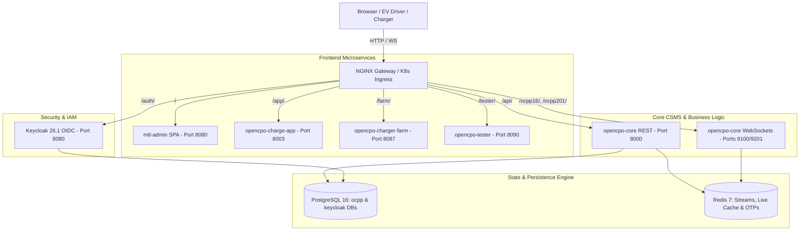

# 🚀 Master Plan: OpenCPO Portable Deployment, Docker Replication & Kubernetes Architecture

**Project:** OpenCPO Enterprise EV Charging Platform  
**Architect:** Winston (System Architect)  
**Status:** Plan Approved for Execution  
**Target Output Directory:** `deploy/`

---

## 1. Executive Summary & Goals

This plan defines the end-to-end technical implementation for packaging OpenCPO into a standalone, portable, and replicable distribution bundle located in `deploy/`. The package will allow OpenCPO to run **anywhere** (single-node Docker Compose, multi-node Kubernetes clusters, AWS EKS, GCP GKE, Azure AKS, K3s, and bare-metal servers) with:
1. **Zero-image-rebuild runtime customizations** (company name, brand colors, tax IDs, SMTP gateways, network ports).
2. **Self-contained state stores** (containerized PostgreSQL 16 with automatic multi-database provisioning, and Redis 7).
3. **Comprehensive Kubernetes orchestration** via both a production-ready Helm chart and vanilla declarative manifests.
4. **Turnkey operations & documentation** including a complete operations runbook and automated `Makefile` CLI.

---

## 2. Directory Structure Specification (`deploy/`)

```
deploy/
├── README.md                          # Master deployment, setup & operations guide
├── .env.template                      # Comprehensive, documented environment variable template
├── docker-compose.prod.yml            # Self-contained production Docker Compose stack
├── docker-compose.dev.yml             # Development stack with volume hot-reloading
├── Makefile                           # Operations automation CLI (up, down, k8s-deploy, seed, backup)
├── init-scripts/
│   ├── 01-init-databases.sql          # Auto-creates 'ocpp' and 'keycloak' databases & extensions
│   ├── 02-seed-enterprise.py          # Dynamic branding, SMTP, and company profile seeder
│   └── 03-keycloak-bootstrap.sh       # Keycloak realm verification & client secret validator
├── nginx/
│   ├── default.conf.template          # NGINX gateway template with dynamic variable injection
│   └── Dockerfile                     # Pre-packaged alpine gateway image
└── kubernetes/
    ├── helm/
    │   └── opencpo/
    │       ├── Chart.yaml             # OpenCPO Helm chart metadata (v2.0.0)
    │       ├── values.yaml            # Default enterprise deployment configuration values
    │       └── templates/
    │           ├── _helpers.tpl       # Helm naming & label templates
    │           ├── configmap.yaml     # Injected platform settings (Company, branding, ports, CORS)
    │           ├── secrets.yaml       # Injected secure credentials (DB, Keycloak, SMTP, JWT)
    │           ├── postgres-statefulset.yaml # HA PostgreSQL StatefulSet + PVC
    │           ├── redis-statefulset.yaml    # Redis StatefulSet + PVC
    │           ├── keycloak-deployment.yaml  # Keycloak 26 IAM deployment & service
    │           ├── core-deployment.yaml      # OCPP Core CSMS deployment (REST + WS)
    │           ├── admin-deployment.yaml     # MTT Admin UI nginx deployment
    │           ├── chargeapp-deployment.yaml # Driver PWA deployment
    │           ├── simulator-deployment.yaml # Charger Farm & Tester deployment
    │           └── ingress.yaml              # Unified ingress with cert-manager TLS annotations
    └── manifests/                     # Vanilla declarative Kubernetes manifests
        ├── 00-namespace.yaml
        ├── 01-configmap.yaml
        ├── 02-secrets.yaml
        ├── 03-storage.yaml
        ├── 04-postgres.yaml
        ├── 05-redis.yaml
        ├── 06-keycloak.yaml
        ├── 07-opencpo-core.yaml
        ├── 08-mtt-admin.yaml
        ├── 09-opencpo-charge-app.yaml
        ├── 10-simulators.yaml
        └── 11-ingress.yaml
```

---

## 3. Microservice & Networking Architecture



---

## 4. Phased Implementation Plan

### Phase 1: Directory Scaffolding & Database Bootstrap Scripts
- Create `deploy/` directory tree with all subdirectories (`init-scripts/`, `nginx/`, `kubernetes/helm/`, `kubernetes/manifests/`).
- Author `deploy/init-scripts/01-init-databases.sql`:
  - Create database `ocpp` and `keycloak` if not present.
  - Enable `uuid-ossp` and `pgcrypto` extensions.
  - Create standard application user `ocpp` with full privileges.
- Author `deploy/init-scripts/02-seed-enterprise.py`:
  - Reads `ENTERPRISE_COMPANY_NAME`, `ENTERPRISE_TAX_NUMBER`, `ENTERPRISE_ADDRESS`, `BRAND_PRIMARY_COLOR`, `BRAND_SECONDARY_COLOR`, `BRAND_LOGO_URL`, and SMTP configuration from environment variables.
  - Dynamically updates `ocpp.settings` table and ensures default branding and communications are seeded on boot without requiring UI clicks.
- Author `deploy/init-scripts/03-keycloak-bootstrap.sh`:
  - Validates Keycloak readiness, ensures `opencpo` realm is active, and verifies client secrets.

### Phase 2: Production Docker Compose Stack & Environment Template
- Author `deploy/docker-compose.prod.yml`:
  - Self-contained containerized PostgreSQL 16 (mounted with `01-init-databases.sql` in `/docker-entrypoint-initdb.d/`).
  - Containerized Redis 7 with healthchecks.
  - Keycloak 26.1 (`quay.io/keycloak/keycloak:26.1`) with `/auth` path, PostgreSQL connection, and auto-imported `realm-export.json`.
  - OpenCPO Core CSMS with automated dependency waiting on PostgreSQL, Redis, and Keycloak.
  - MTT Admin UI (Nginx container serving prebuilt React 19 SPA).
  - OpenCPO Charge App (Driver PWA).
  - Charger Farm (Simulator) & Compliance Tester.
  - Unified Nginx Gateway exposing only the configured public HTTP/HTTPS ports.
- Author `deploy/docker-compose.dev.yml`:
  - Equivalent multi-service setup with live volume mounts for local development.
- Author `deploy/.env.template`:
  - Complete, structured, and commented list of all runtime environment variables across all services.

### Phase 3: NGINX Gateway Template & Image Packaging
- Author `deploy/nginx/default.conf.template`:
  - Dynamic proxy configuration using environment variables for port numbers and domain names.
  - Large proxy buffers (`128k/256k`) for Keycloak headers.
  - WebSocket upgrade mappings with 24-hour read/send timeouts for OCPP WebSocket connections.
- Author `deploy/nginx/Dockerfile`.

### Phase 4: Production Kubernetes Helm Chart (`deploy/kubernetes/helm/opencpo/`)
- Author `Chart.yaml`: Helm chart metadata (name: `opencpo`, version: `2.0.0`, appVersion: `2.0.0`).
- Author `values.yaml`: Complete configurable defaults for enterprise branding, SMTP, ports, resource quotas, persistence sizes, and Ingress settings.
- Author Helm templates:
  - `_helpers.tpl`: Common labels, selector labels, and name templates.
  - `configmap.yaml`: Injected company branding, company metadata, CORS, and network settings.
  - `secrets.yaml`: Base64-encoded secrets for PostgreSQL, Redis, Keycloak admin, SMTP passwords, and API keys.
  - `postgres-statefulset.yaml`: HA PostgreSQL StatefulSet with persistent volume claim (`20Gi` default).
  - `redis-statefulset.yaml`: Redis StatefulSet with persistent volume claim (`5Gi` default).
  - `keycloak-deployment.yaml`: Keycloak 26 Deployment and ClusterIP service.
  - `core-deployment.yaml`: OCPP Core Deployment (REST API + OCPP 1.6 & 2.0.1 WebSocket services).
  - `admin-deployment.yaml`: MTT Admin UI Deployment and service.
  - `chargeapp-deployment.yaml`: Driver PWA Deployment and service.
  - `simulator-deployment.yaml`: Charger Farm and Compliance Tester deployments.
  - `ingress.yaml`: Ingress controller with TLS termination and WebSocket tuning.

### Phase 5: Plain Declarative Kubernetes Manifests (`deploy/kubernetes/manifests/`)
- Author standalone declarative manifests (`00-namespace.yaml` through `11-ingress.yaml`) for clusters not using Helm.

### Phase 6: Operations Automation & CLI (`deploy/Makefile`)
- Provide unified commands:
  - `make up`: Start complete production Docker Compose stack.
  - `make down`: Gracefully stop Docker stack.
  - `make seed-enterprise`: Run runtime company branding and SMTP configuration seeder.
  - `make k8s-install`: Deploy Helm chart to target Kubernetes cluster.
  - `make k8s-status`: Inspect pods, services, statefulsets, and ingress in `opencpo` namespace.
  - `make backup`: Execute automated Postgres and Redis state snapshot.
  - `make test`: Run platform automated verification suite.

### Phase 7: Master Documentation & Runbook (`deploy/README.md`)
- Author comprehensive, clear, and professional README covering:
  1. System Architecture & Prerequisites (Docker 24+, Compose v2, Helm 3, Kubernetes 1.26+).
  2. 60-Second Quickstart (Docker Compose).
  3. Production Kubernetes Deployment (Helm & Plain Manifests).
  4. Dynamic Customization Guide (How to customize company name, address, tax ID, brand colors, SMTP mail server, and ports via `.env` or `values.yaml`).
  5. Ingress & TLS Certificate Setup (cert-manager & Let's Encrypt).
  6. Operational Runbook (Database backups, restores, rolling updates, and troubleshooting).

### Phase 8: Verification & Automated Dry-Run Testing
- Validate all Docker Compose configurations using `docker compose -f deploy/docker-compose.prod.yml config`.
- Validate all Helm templates using `helm lint deploy/kubernetes/helm/opencpo` and `helm template opencpo deploy/kubernetes/helm/opencpo`.
- Verify database bootstrap SQL syntax and enterprise seeder script.

---

## 5. Dynamic Customization Invariants & Mapping

| Customization Target | Helm `values.yaml` Path | Compose `.env` Variable | Injection Target |
| :--- | :--- | :--- | :--- |
| **Company Name** | `enterprise.companyName` | `ENTERPRISE_COMPANY_NAME` | `ocpp.settings` + Admin UI Header |
| **Company Legal Address** | `enterprise.legalAddress` | `ENTERPRISE_ADDRESS` | Billing CDRs + Invoice PDFs |
| **Tax / VAT ID** | `enterprise.taxNumber` | `ENTERPRISE_TAX_NUMBER` | Billing engine & receipts |
| **Primary Theme Color** | `enterprise.branding.primaryColor` | `BRAND_PRIMARY_COLOR` | CSS Theme variables & Keycloak UI |
| **Secondary Accent Color**| `enterprise.branding.secondaryColor`| `BRAND_SECONDARY_COLOR`| Chart palettes & highlights |
| **Platform Logo URL** | `enterprise.branding.logoUrl` | `BRAND_LOGO_URL` | Header & mobile branding |
| **SMTP Host** | `smtp.host` | `SMTP_HOST` | Core mailer service |
| **SMTP Port** | `smtp.port` | `SMTP_PORT` | Core mailer service (587/465) |
| **SMTP Username** | `smtp.user` | `SMTP_USER` | Core mailer service |
| **SMTP Password** | `smtp.password` | `SMTP_PASS` | K8s Secret / Compose Secret |
| **SMTP Sender Address** | `smtp.fromAddress` | `SMTP_FROM_ADDRESS` | Outgoing OTP & receipt emails |
| **Gateway HTTP Port** | `networking.ports.http` | `GATEWAY_PORT` | NGINX Listen / NodePort |
| **OCPP 1.6 WS Port** | `networking.ports.ocpp16Ws` | `OCPP_16_WS_PORT` | Core WS Listener (9100) |
| **OCPP 2.0.1 WS Port** | `networking.ports.ocpp201Ws`| `OCPP_201_WS_PORT`| Core WS Listener (9201) |

---

## 6. Execution Verdict

This plan is ready for immediate execution. Upon approval, all files will be generated, tested, and validated.
