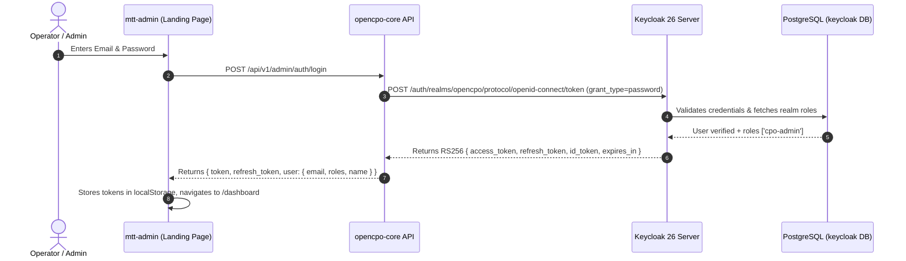
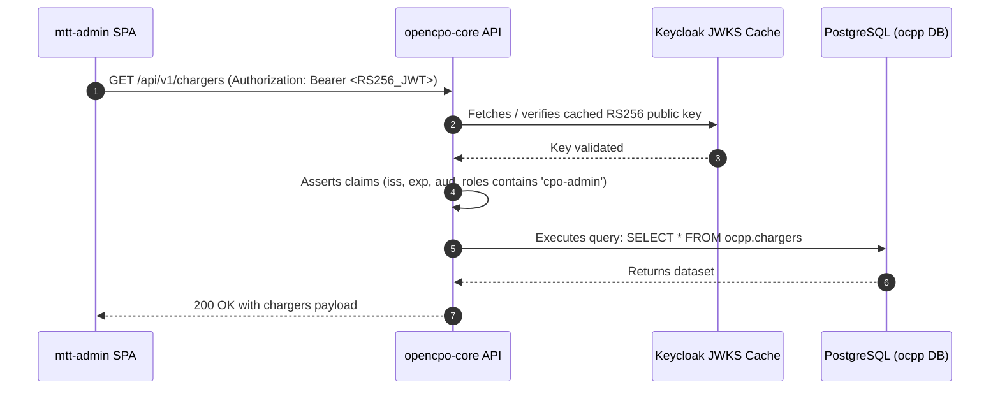

# OpenCPO Keycloak Enterprise Identity & Access Management (IAM) Specification

```yaml
title: OpenCPO Keycloak IAM Architecture & Integration Specification
version: "1.0.0"
date: "2026-09-08"
status: approved
author: Winston (System Architect) & Danielaroko
scope: Identity & Access Management (IAM), SSO, RBAC, OAuth2/OIDC
components: [quay.io/keycloak/keycloak:26, opencpo-core, mtt-admin, opencpo-charge-app, nginx]
```

---

## 1. Architecture Overview & System Topology

OpenCPO integrates **Keycloak 26** as its unified Identity and Access Management (IAM) engine. It provides centralized authentication, fine-grained Role-Based Access Control (RBAC), multi-factor authentication (MFA), and single sign-on (SSO) across the operator dashboard (`mtt-admin`), driver mobile application (`opencpo-charge-app`), and core REST API (`opencpo-core`).

```
+----------------------------------------------------------------------------------------------------+
|                                      NGINX REVERSE PROXY                                           |
|                     (opencpo.mapletyne.com / auth.opencpo.mapletyne.com / :34080)                  |
+------------------------------------+------------------------------------+--------------------------+
                                     |                                    |
          +--------------------------+--------------------------+         |
          | Direct Grant Login /     | Bearer Token Validations |         | /auth/
          v                          v                          |         v
+-----------------------+  +-----------------------+            |  +-----------------------+
|  Operator Dashboard   |  |   Driver PWA / App    |            |  |       Keycloak        |
|      (mtt-admin)      |  | (opencpo-charge-app)  |            |  | (quay.io/keycloak:26) |
| [Dark Glassmorphic UI]|  |   [Driver Portal]     |            |  |    Realm: 'opencpo'   |
+-----------+-----------+  +-----------+-----------+            |  +-----------+-----------+
            |                          |                        |              |
            +--------------------------+                        |              | JWKS / Token
            | RS256 Bearer Token                                |              | Endpoints
            v                                                   |              |
+---------------------------------------------------------------+              |
|                     Core CSMS REST API (opencpo-core)                        |
|       - OAuth2 Resource Server (Verifies RS256 Signature via JWKS)           |
|       - Hierarchical RBAC Route Guards (cpo-admin, site-operator, etc.)      |
|       - Startup Sync & User Migration Engine                                 |
+---------------------------------------+--------------------------------------+
                                        |
                                        v
                    +---------------------------------------+
                    |          PostgreSQL Database          |
                    |  - Database 'ocpp' (Core CSMS)        |
                    |  - Database 'keycloak' (IAM State)    |
                    +---------------------------------------+
```

---

## 2. Invariant Architectural Decisions

### `AD-11 [ADOPTED]: Keycloak Unified Identity & Access Management (IAM) Invariant`
- **Binds**: User identity, token issuance, credential verification, RBAC route guards across all UI portals and REST APIs.
- **Prevents**: Decentralized password storage, hardcoded roles, fragmented driver/operator auth silos, and session fixation vulnerabilities.
- **Rule**:
  1. **IAM Engine**: `quay.io/keycloak/keycloak:26` container co-located in `docker-compose.yml`, using a dedicated `keycloak` database in PostgreSQL and proxied via NGINX under `/auth/` and `auth.opencpo.mapletyne.com`.
  2. **Landing Page Authentication Flow**: Direct Access Grants (`urn:ietf:params:oauth:grant-type:password-credentials`) against `/auth/realms/opencpo/protocol/openid-connect/token` via `/api/v1/admin/auth/login`. This preserves the dark glassmorphic landing page styling without abrupt external browser redirects.
  3. **Resource Server Verification**: `opencpo-core` validates incoming `Authorization: Bearer <token>` RS256 JWTs using cached public keys from Keycloak's JWKS endpoint (`/.well-known/openid-configuration` & `/protocol/openid-connect/certs`).
  4. **Backward Compatibility**: Dual-channel authentication is preserved; machine-to-machine integration scripts, simulators, and CLI tools using `X-API-Key: <MANAGEMENT_API_KEY>` remain 100% operational.
  5. **Role Hierarchy**: Keycloak realm roles map strictly to frontend views and backend route guards:
     - `cpo-admin`: Full system, PKI vault, backup, settings, and network authority.
     - `site-operator`: Station control, charger commands, tariff assignments.
     - `billing-manager`: CDRs, financial settlements, host revenue splits.
     - `fleet-manager`: Corporate RFID tokens, fleet EVs, group management.
     - `driver`: Mobile PWA access, wallet, charging sessions.
  6. **Declarative Auto-Provisioning**: Realm configurations are committed to `keycloak/realm-export.json` and mounted into `/opt/keycloak/data/import/` for zero-touch provisioning on first startup, backed by startup validation in `opencpo-core`.

---

## 3. Realm & Client Configuration Matrix

### Realm: `opencpo`
- **Display Name**: OpenCPO Mission Control
- **Login Theme**: `keycloak` / customized OpenCPO brand tokens
- **Access Token Lifespan**: 3600 seconds (1 hour)
- **SSO Session Idle**: 86400 seconds (24 hours)
- **SSO Session Max**: 2592000 seconds (30 days)

### OIDC Clients:

| Client ID | Client Type | Direct Access Grants | Standard Flow (Code+PKCE) | Target Application |
| :--- | :--- | :---: | :---: | :--- |
| `opencpo-admin-ui` | Public | **Enabled** | Enabled | `mtt-admin` Operator Dashboard |
| `opencpo-charge-app` | Public | **Enabled** | Enabled | `opencpo-charge-app` Driver PWA |
| `opencpo-backend` | Confidential | Disabled | Service Accounts | `opencpo-core` Admin REST API Sync |

---

## 4. Role-Based Access Control (RBAC) Matrix

| Endpoint Group | Required Role(s) | Description |
| :--- | :--- | :--- |
| `/api/v1/chargers/*` | `cpo-admin`, `site-operator` | View and control charging stations |
| `/api/v1/sessions/*` | `cpo-admin`, `site-operator`, `billing-manager` | View charging sessions and CDR billing records |
| `/api/v1/tariffs/*` | `cpo-admin`, `billing-manager` | Create and assign billing tariff structures |
| `/api/v1/fleet/*`, `/api/v1/tokens/*` | `cpo-admin`, `fleet-manager` | Provision RFID cards and manage corporate fleets |
| `/api/v1/pki/*` | `cpo-admin` | ISO 15118 PKI Root/Sub-CA and certificate signing |
| `/api/v1/settings/*` | `cpo-admin` | System settings, branding, SMTP/SMS, backups |
| `/api/v1/driver-accounts/*` | `driver`, `cpo-admin` | Manage driver wallet, payment methods, vehicles |

---

## 5. Token Flow & Exchange Sequences

### 5.1 Direct Grant Landing Page Login Sequence


### 5.2 Authenticated Request Verification Sequence


---

## 6. Implementation Roadmap & Execution Checklist

- [ ] **Phase 1: Database & Keycloak Container Setup**
  - Create database `keycloak` in PostgreSQL.
  - Author declarative `keycloak/realm-export.json`.
  - Add `keycloak` service definition to `docker-compose.yml`.
- [ ] **Phase 2: NGINX Ingress Routing**
  - Configure `/auth/` proxy pass in `nginx/default.conf`.
  - Configure `auth.opencpo.mapletyne.com` subdomain block.
- [ ] **Phase 3: Backend Resource Server Engine (`opencpo-core`)**
  - Implement `auth/keycloak_client.py` with JWKS key caching.
  - Refactor `api/admin_auth.py` and `api/api_key_auth.py` for RS256 validation.
  - Implement startup health check and user sync hook.
- [ ] **Phase 4: Frontend Landing Page & Session Management (`mtt-admin`)**
  - Update `api-client.ts` with transparent refresh token interceptor.
  - Connect `LoginPage.tsx` to Direct Grant flow.
  - Add active user profile and roles indicator to top app bar.
- [ ] **Phase 5: Verification & Automated E2E Testing**
  - Deploy containers (`docker compose up -d`).
  - Run full test suite (`python3 tests/test_e2e_all_apis_buttons_links.py`).
