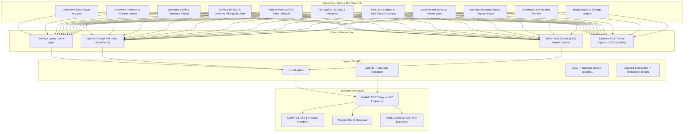

# Software Requirements Specification (SRS) & PRD
## OpenCPO Enterprise Custom Admin (`mtt-admin`) & White-Label Platform

---

## 1. Executive Summary & Vision

OpenCPO is an enterprise-grade Charge Point Operator (CPO) management system. This document defines the formal software requirements for replacing the legacy server-rendered admin dashboard with **`mtt-admin`**—a modern, high-density, real-time management dashboard built on the **Industrial Intelligence** design philosophy.

In addition to full operational control over charging hardware, tariffs, fleet groups, ISO 15118 PKI, and EMS energy balancing, `mtt-admin` introduces:
1. **A Global White-Label & Branding Engine (`/settings/branding`)** that dynamically propagates brand assets (logos, colors, typography, legal entity) across the entire platform ecosystem.
2. **Three Strategic Competitive Differentiators**:
   * **Multi-Tenant Site Host Revenue Splits & Payout Engine**: Automated financial settlements for property hosts and depot partners.
   * **Automated Fault Detection & Tiered Self-Healing Engine**: Proactive diagnostic, cable release, and soft-reset sequences driven by real-time SSE events.
   * **Advanced "What-If" Dynamic Tariff Simulator**: Historical session playback against spot-market pricing formulas to forecast gross margins before deploying to live chargers.

---

## 2. Target Personas

1. **CPO Operations Administrator:** Oversees network health, provisions EVSEs, sets tariffs, and executes remote operational commands.
2. **Site Host & Property Partner:** Reviews station uptime and receives itemized monthly revenue-share payouts for host locations.
3. **Fleet & Corporate Manager:** Manages corporate driver groups, assigns RFID tokens, and audits aggregated billing and session histories.
4. **Energy & Grid Specialist:** Defines site grid capacity, monitors real-time solar/battery/EV energy balances, and configures smart load balancing curtailment algorithms.
5. **Security & Compliance Officer:** Manages ISO 15118 PKI certificate lifecycles, inspects SECC/Contract certificates, and audits cryptographic events.

---

## 3. Technology Stack & Architectural Decisions

The frontend architecture transitions from server-rendered HTML to a decoupled, high-performance **Single Page Application / Hybrid SSR** stack:

```
┌─────────────────────────────────────────────────────────────────────────────────┐
│                          mtt-admin Frontend Stack                                │
├───────────────────────────────┬─────────────────────────────────────────────────┤
│ Framework                     │ Next.js 15 (App Router) / Vite + React 19       │
│ Language & Type Safety        │ TypeScript 5.x (Strict mode)                    │
│ Type Generation               │ openapi-typescript (direct from openapi.json)  │
│ UI Components & Design System │ shadcn/ui + Radix UI + Tailwind CSS v4          │
│ Server State & Caching        │ TanStack Query v5 (React Query)                 │
│ Large-Scale Data Tables       │ TanStack Table v8 + TanStack Virtual            │
│ Real-Time Streaming           │ Native EventSource (Server-Sent Events)         │
│ Icons & Visual Media          │ Lucide React + Vector SVG Asset Pipelines       │
└───────────────────────────────┴─────────────────────────────────────────────────┘
```

---

## 4. System Architecture & Wiring Diagram



---

## 5. Strategic Competitive Differentiators Specification

### 5.1 Multi-Tenant Site Host Revenue Splits & Payout Engine
* **Objective:** Enable multi-tenant revenue settlements for property owners, retail hosts, and fleet depots.
* **Functional Logic:**
  1. Filter charging assets by property location (`GET /api/v1/chargers?site={site_id}`).
  2. Aggregate gross charging transactions over billing periods (`GET /api/v1/sessions?cp_id=...&from=...&to=...`).
  3. Deduct wholesale electricity pass-through cost and OCPI roaming commissions (`GET /api/v1/ocpi/partners`).
  4. Apply configurable contractual split percentages:
     $$\text{Host Payout} = (\text{Gross Revenue} - \text{Energy Cost} - \text{Commission}) \times \text{Host Split \%}$$
  5. Generate downloadable monthly settlement PDF statements and automated CSV export.

### 5.2 Automated Fault Detection & Tiered Self-Healing Engine
* **Objective:** Minimize hardware downtime and eliminate manual technician dispatches for soft errors.
* **Functional Logic:**
  1. Stream real-time hardware status events via `GET /api/v1/events/stream`.
  2. Trigger automated recovery pipeline upon detecting `StatusNotification` where `status == 'Faulted'` or `errorCode != 'NoError'`:
     * **Phase 1 (Verification):** Dispatch `POST /api/v1/chargers/{cp_id}/trigger?message=StatusNotification`.
     * **Phase 2 (Cable Jam Resolution):** If connector remains locked in `Finishing`, invoke `POST /api/v1/chargers/{cp_id}/unlock?connector_id={id}`.
     * **Phase 3 (OS Soft Reboot):** If fault persists for >60 seconds, issue `POST /api/v1/chargers/{cp_id}/reset?reset_type=Soft`.
     * **Phase 4 (RFID Cache Flush):** If authorization fails repeatedly, execute `POST /api/v1/chargers/{cp_id}/clear-cache`.
     * **Phase 5 (Escalation):** If hardware remains unresponsive after 3 minutes, post an emergency incident webhook (`POST /api/v1/events/webhooks`).

### 5.3 Advanced "What-If" Dynamic Tariff Simulator
* **Objective:** Provide predictive financial intelligence by simulating dynamic pricing tiers against real historical charging curves.
* **Functional Logic:**
  1. Ingest historical 15-minute time-stamped power samples (`GET /api/v1/sessions/{session_id}/meter`).
  2. Retrieve Day-Ahead spot market benchmark rates (`GET /api/v1/pricing/current` & `GET /api/v1/pricing/config`).
  3. Replay historical energy consumption against proposed formula:
     $$\text{Simulated Price}(t) = (\text{SpotPrice}_t \times \text{Multiplier}) + \text{MarginPerKwh}$$
  4. Display comparative chart metrics: Baseline vs. Simulated Revenue, Gross Margin %, and Peak/Off-Peak driver price sensitivity.
  5. 1-click publish of the tested model to production tariffs (`PUT /api/v1/pricing/config` or `POST /api/v1/pricing/tiers`).

---

## 6. Global White-Label & Dynamic Branding Engine (`/settings/branding`)

The `/settings/branding` interface allows complete visual and corporate customization. All changes saved in the admin portal propagate instantly across the entire platform via the OpenCPO Core REST APIs.

### 6.1 Configurable Brand Properties

| Property | Data Type | Default | Platform Impact |
| :--- | :--- | :--- | :--- |
| `company_name` | `string` | `OpenCPO Energy` | Displayed on Admin Shell, Driver footer, and Invoice Legal Header |
| `app_title` | `string` | `OpenCPO Charge` | Title tag, PWA `name`, and mobile header |
| `logo_url` | `string (URL/SVG)` | `/skin/logo.svg` | Desktop header logo and PDF receipt header |
| `icon_url` | `string (PNG)` | `/skin/icon-192.png`| Mobile header mark, favicon, and PWA home-screen icon |
| `primary_color` | `hex string` | `#10b981` | Main CTA buttons, active tabs, and primary badges |
| `accent_color` | `hex string` | `#48e260` | Real-time charging glow, live status indicators, and focus states |
| `bg_color` | `hex string` | `#0a100d` | Deep background dark canvas |
| `card_color` | `hex string` | `#131f18` | Surface cards, tables, and modal backgrounds |
| `support_email` | `email` | `support@cpo.com` | Printed on driver receipts, invoices, and help modals |
| `support_phone` | `phone` | `+44...` | Displayed in driver emergency help section |

### 6.2 API Integration & Propagation Flow

1. **Saving Branding Configuration:**
   The admin UI executes atomic updates to `PUT /api/v1/settings/{key}` or `POST /api/v1/admin/setup/step/branding`.
2. **Admin Real-Time Injection:**
   The `ThemeProvider` injects updated CSS variables directly into `:root`, updating the Next.js UI immediately without a page reload:
   ```css
   :root {
     --primary: #10b981;
     --accent: #48e260;
     --background: #0a100d;
     --card: #131f18;
   }
   ```
3. **Driver PWA Propagation:**
   `opencpo-charge-app` queries `GET /api/v1/settings` and dynamically serves updated brand assets through `/skin/logo.svg`, `/skin/style.css`, and `/manifest.json`.

---

## 7. Complete Feature Backlog & User Stories

### **Epic 1: Foundation, Auth & OpenAPI Type Generation**
* **Story 1.1:** Scaffold Next.js 15 / React 19 project with TypeScript, Tailwind CSS, and shadcn/ui.
* **Story 1.2:** Integrate `openapi-typescript` build script to generate 100% strict TypeScript types from OpenCPO Core's `/openapi.json`.
* **Story 1.3:** Implement `api-client.ts` with JWT Bearer authentication interceptor and automatic token refresh/redirect on 401.

### **Epic 2: Brand Studio & Dynamic Theming (`/settings/branding`)**
* **Story 2.1:** Build Brand Studio UI allowing logo upload, company name, legal metadata, and primary/accent color picker.
* **Story 2.2:** Wire the branding form to `PUT /api/v1/settings/{key}` and `POST /api/v1/admin/setup/step/branding`.
* **Story 2.3:** Implement `ThemeProvider` to inject customized CSS variables into the DOM, instantly updating `mtt-admin` and propagating to the Charge App skin.

### **Epic 3: Virtualized Asset & Session Management**
* **Story 3.1:** Implement Charger Inventory Table using TanStack Table with status badges, inline search, and pagination.
* **Story 3.2:** Build Charger Detail Drawer (`charger_detail_panel_state`) with live power gauge and remote operations (Reset, Start, Stop, SetChargingProfile).
* **Story 3.3:** Build Sessions & Billing Ledger with TanStack Virtual Table capable of smoothly scrolling 100,000+ CDRs with date-range filters and CSV export.

### **Epic 4: Real-Time Event Streaming & Self-Healing Monitor**
* **Story 4.1:** Create `useLiveEvents` hook subscribing to `GET /api/v1/events/stream`.
* **Story 4.2:** On incoming `StatusNotification` or `MeterValues`, trigger TanStack Query cache invalidations (`queryClient.invalidateQueries(['chargers'])`).
* **Story 4.3:** Implement automated self-healing execution pipeline (Trigger ➔ Unlock ➔ Soft Reset ➔ Webhook escalation).

### **Epic 5: Financial Settlement & Site Host Splits**
* **Story 5.1:** Build Site Host Payout Calculator grouping sessions by `site_id`.
* **Story 5.2:** Implement contractual split configuration and monthly payout statement PDF generation.

### **Epic 6: "What-If" Tariff Simulator**
* **Story 6.1:** Build interactive Tariff Builder with ENTSO-E spot price integration.
* **Story 6.2:** Implement client-side session playback replay engine calculating projected vs. historical margins.

### **Epic 7: Security Vault & Energy Management**
* **Story 7.1:** Build ISO 15118 PKI visual trust hierarchy tree and CSR certificate signer.
* **Story 7.2:** Build EMS real-time circular energy flow gauge displaying Grid vs Solar vs Battery vs EV load.

---

## 8. Integration Architecture & Code Recipes

### 8.1 OpenAPI Code Generation (`package.json`)
```json
{
  "scripts": {
    "codegen": "openapi-typescript http://127.0.0.1:8000/openapi.json -o src/lib/types/api.ts"
  }
}
```

### 8.2 Real-Time SSE Stream Hook (`src/hooks/use-live-events.ts`)
```typescript
import { useEffect } from 'react';
import { useQueryClient } from '@tanstack/react-query';

export function useLiveEvents() {
  const queryClient = useQueryClient();

  useEffect(() => {
    const sse = new EventSource('/api/v1/events/stream');

    sse.addEventListener('charger.status', (e) => {
      const data = JSON.parse(e.data);
      // Invalidate chargers cache on status transition
      queryClient.invalidateQueries({ queryKey: ['chargers'] });
      queryClient.invalidateQueries({ queryKey: ['charger', data.charge_point] });
    });

    sse.addEventListener('meter.values', (e) => {
      const data = JSON.parse(e.data);
      queryClient.setQueryData(['telemetry', data.charge_point], data);
    });

    sse.onerror = () => sse.close();
    return () => sse.close();
  }, [queryClient]);
}
```

### 8.3 Self-Healing Fault Recovery Handler (`src/lib/self-healing.ts`)
```typescript
import { apiClient } from '@/lib/api-client';

export async function remediateFault(cpId: string, connectorId: number) {
  // Step 1: Refresh status
  await apiClient.post(`/chargers/${cpId}/trigger?message=StatusNotification`);
  
  // Step 2: Emergency cable unlock
  await apiClient.post(`/chargers/${cpId}/unlock?connector_id=${connectorId}`);
  
  // Step 3: Soft reboot after grace period
  setTimeout(async () => {
    await apiClient.post(`/chargers/${cpId}/reset?reset_type=Soft`);
  }, 15000);
}
```

---

## 9. Non-Functional Requirements & Performance Benchmarks

1. **Sub-Second Command Latency:** Remote charger actions (Start, Stop, Reset) must dispatch via REST and provide immediate optimistic visual feedback within **< 250ms**.
2. **60 FPS Table Scrolling:** The Sessions & Meter Values ledger must maintain **60 FPS scrolling performance** under 100,000+ rows using TanStack Virtual.
3. **100% Type Safety:** Zero `any` types in data pipelines; all models must strictly derive from the OpenAPI 3.0 schema.
4. **Resilient SSE Reconnection:** EventSource must implement exponential backoff reconnection logic to ensure zero telemetry drops during network fluctuations.
