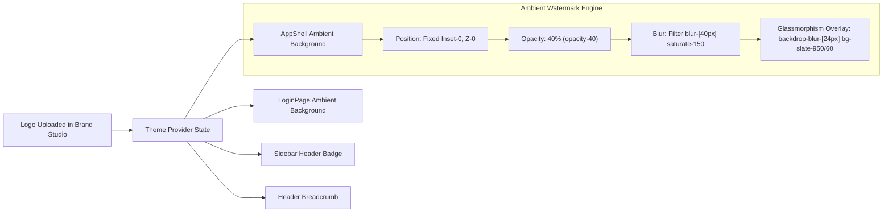

# 🎨 UX Design Specification: Settings Readability, 12pt Typography Standardization, Background Logo Watermark & White-Labeling

**Lead Designer:** Sally (UX Designer)  
**Target Application:** MTT Admin Portal (`mtt-admin`)  
**Status:** Approved & Synchronized Specification  

---

## 1. Executive Summary & Core Requirements

This specification formalizes the UX and visual architecture adjustments for the MTT Admin dashboard:

1. **Strict Blank Fallback Rule (`""`)**:
   - If no company name or branding value is set, the system **MUST** fall back to an empty space (`""` / blank), rather than falling back to `"OpenCPO"` or any other arbitrary hardcoded string.
2. **Terminology Modernization (Deprecating Vague Sci-Fi Tropes)**:
   - `"Mission Control"` $\rightarrow$ **`"Charge Station Management System"`**
   - `"Industrial Intelligence"` $\rightarrow$ **`"Enterprise EV Charging Management (CSMS)"`**
   - Remove all mentions of `"OpenCPO"` from public and operator-facing screens.
3. **Ambient Background Logo Watermark with Glassmorphism**:
   - When a company logo is uploaded, it is dynamically rendered in the background of the application shell (and login screen), filling the viewport at **40% opacity** with heavy Gaussian blur (`blur-[35px]` / `backdrop-blur-[24px]`) to create an elegant, branded glassmorphic aesthetic without hindering content readability.
4. **Standardized Minimum Typography (12pt / 16px Rule)**:
   - Form inputs must be a minimum of **12 pt** (16px / `text-base font-sans text-slate-100`) with generous `h-11 px-4` touch targets.
   - Field labels are set to `text-sm font-semibold text-slate-200` (14px) to eliminate illegible 10px / mono micro-text.
5. **Live Dynamic Replication Across Platform**:
   - Any change committed in the Settings tab (Organization, Brand Studio, SMTP, etc.) must instantly propagate across:
     - Document Title (`<title>`)
     - Top Navigation Header (`Header.tsx`)
     - Sidebar Brand Container (`Sidebar.tsx`)
     - AppShell Background Watermark (`AppShell.tsx`)
     - Login & Registration View (`LoginPage.tsx`)

---

## 2. Standardized Typography Hierarchy

| Component / Element | Previous Class | Updated Class | Computed Size | Visual Rationale |
| :--- | :--- | :--- | :--- | :--- |
| **Form Inputs** | `text-xs font-mono h-9` | `text-base font-sans h-11 px-4` | **16px (12 pt)** | Prevents squinting, provides clear contrast and crisp rendering |
| **Form Labels** | `text-[10px] uppercase font-mono` | `text-sm font-semibold text-slate-200` | **14px (10.5 pt)** | Readable, clear semantic description |
| **Page Title (H1)** | `text-2xl font-bold` | `text-3xl font-headline font-bold` | **30px (22.5 pt)** | Clear page hierarchy |
| **Section Header (H2)**| `text-lg font-bold` | `text-xl font-headline font-bold` | **20px (15 pt)** | Distinct card/section separation |
| **Secondary Descriptions**| `text-[11px] font-mono` | `text-xs text-slate-400 font-body` | **12px (9 pt)** | Non-critical helper text |

---

## 3. Brand Watermark Visual Specification



### Ambient Background Layer Implementation:
```tsx
{activeLogo && (
  <div className="fixed inset-0 pointer-events-none z-0 overflow-hidden flex items-center justify-center opacity-40 select-none">
    
    <div className="absolute inset-0 backdrop-blur-[24px] bg-slate-950/60" />
  </div>
)}
```

---

## 4. Verification & Testing Protocol

1. **Branding Persistence & Blank Fallback Test**:
   - Open Settings $\rightarrow$ Brand Studio.
   - Clear Company Name and save. Assert that Header and Sidebar display an empty space/blank instead of `"OpenCPO"`.
2. **Typography Verification**:
   - Inspect all input elements on Settings and Login pages; assert computed `font-size: 16px` (12pt) and `line-height: 24px`.
3. **Background Watermark Verification**:
   - Upload or set a test company logo in Brand Studio.
   - Assert that the background watermark container is rendered with `opacity-40` and `backdrop-blur`.
4. **Terminology Audit**:
   - Run a ripgrep scan across `mtt-admin/src` to ensure zero instances of `"Mission Control"` or unbranded `"OpenCPO"` strings exist in user-facing JSX.
