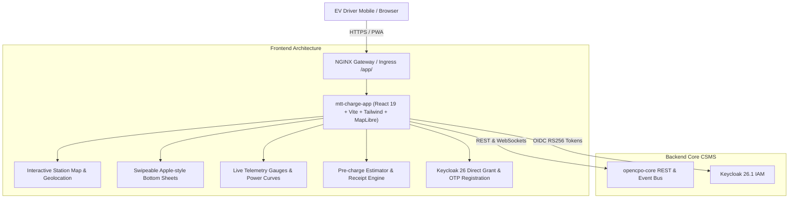

# ⚡ Architecture & Implementation Plan: Next-Gen OpenCPO Driver App (`mtt-charge-app`)

**Author:** Winston (System Architect)  
**Target:** Replace legacy Jinja2/Starlette `opencpo-charge-app` with a unified React 19 / TypeScript / Vite Apple HIG Mobile PWA  
**Status:** Plan Proposed for Architecture Review & Feedback  

---

## 1. Executive Summary & Design Vision

This plan defines the architectural overhaul to replace the legacy Python Jinja2 `opencpo-charge-app` with a unified, high-performance, mobile-first **React 19 Single Page Application & Progressive Web App (PWA)** named **`mtt-charge-app`** (or `opencpo-driver-app`).

The new driver app directly inherits and extends the **Apple HIG Dark Glassmorphic Design System** established in `mtt-admin`, creating a seamless, polished, and unified ecosystem for both CPO operators and EV drivers.



---

## 2. Core Architectural Pillars

### 1. Unified Design System & Design Tokens
* Directly mirrors [`mtt-admin/tailwind.config.js`](file:///home/danielaroko/applications/opencpo/mtt-admin/tailwind.config.js):
  * **Surface Palette**: `#0b1326` background, `#171f33` surface cards, `#222a3d` interactive containers.
  * **Accents & States**: `#4edea3` (OpenCPO Emerald Primary), `#3b82f6` (Electric Blue), `#10b981` (Available), `#f97316` (Charging/Busy), `#ef4444` (Faulted).
  * **Typography**: `-apple-system`, `Inter`, `Geist`, and `Geist Mono`.
  * **Apple Elevation**: Layered shadows (`apple-sm`, `apple-md`, `apple-lg`), `backdrop-blur-2xl` glassmorphic sheets.

### 2. Mobile-First Ergonomics & Apple Interaction Patterns
* **Swipeable Bottom Sheets**: Native touch-driven bottom drawer for station details, connector selection, and session controls.
* **Apple Activity Rings & Gauges**: Circular SVG progress rings for battery State of Charge (SoC %) and charging power (kW).
* **Zero Range Sliders**: Crisp numeric stepping pills, quick-select buttons (+10 kWh, +25 kWh, +50 kWh, Full Charge), and tactile toggles.
* **Haptic Touch & Micro-Animations**: Smooth transitions with CSS hardware acceleration and framer-style spring physics.

### 3. PWA Capabilities (Progressive Web App)
* Web App Manifest (`manifest.json`) for **"Add to Home Screen"** on iOS and Android.
* Offline caching for static assets, station metadata, and user preferences via Service Worker.
* Standalone mobile display mode with customized theme color (`#070d19`) and dynamic viewport safe-area insets (`env(safe-area-inset-top)` / `env(safe-area-inset-bottom)`).

### 4. Direct Keycloak 26 IAM & Guest Instant-Charge Flow
* **Seamless Driver Registration**: Reuses the two-step email OTP registration flow with automatic `driver` realm role.
* **Guest Ad-hoc Charging**: Instant QR code scanning or station ID lookup allowing ad-hoc charging with Apple Pay / Google Pay / Credit Card without mandatory registration.

---

## 3. Screen Hierarchy & Driver Journey

```
mtt-charge-app/
├── 1. Map & Station Discovery (/ or /map)
│   ├── Interactive OpenStreetMap / MapLibre Dark Vector Canvas
│   ├── Geolocation ("Find Nearest Charger")
│   ├── Filter Bar (Connector Type: CCS2, CHAdeMO, Type 2; Min Power: 50kW, 150kW, 350kW)
│   └── Station Bottom Sheet Preview (Pricing, distance, real-time availability)
│
├── 2. Station & Connector Detail (/station/:id)
│   ├── Live Connector Grid (Connector 1: Available 350kW, Connector 2: In Use)
│   ├── Active Dynamic Tariff Rates (€0.44/kWh + €0.05/min idle fee)
│   ├── Pre-Charge Cost & Range Estimator (+20kWh -> €8.80, +120 km range)
│   └── "Start Charge" Action Bar
│
├── 3. Live Active Charging Session (/session/:id)
│   ├── Real-time Battery SoC Ring (%) & Instant Power (kW)
│   ├── Live Energy Delivered (kWh) & Session Duration Counter
│   ├── Real-time Dynamic Cost Tracker (€)
│   ├── Live ECharts Charging Curve (Power kW & Voltage over time)
│   └── Slide-to-Stop / Confirm Stop Charging Button
│
├── 4. Session Receipt & Invoice (/receipt/:id)
│   ├── Itemized CDR summary (Energy, Idle fee, Tax, Total)
│   ├── Download PDF Receipt Button
│   └── Add to Favorites / Rate Station
│
├── 5. Driver Wallet & RFID Management (/wallet)
│   ├── Saved Payment Methods (Stripe / Cards / SEPA)
│   ├── Linked RFID Cards & Tokens (Add/Block RFID)
│   └── ISO 15118 Plug & Charge Digital Certificate Auto-Install
│
├── 6. Charging History (/history)
│   ├── Chronological list of completed sessions with search & filtering
│   └── Monthly spending breakdown chart
│
└── 7. Authentication & Profile (/login, /register, /profile)
    ├── Keycloak Direct Grant login & Two-step email OTP verification
    └── Vehicle profile (Make, Model, Battery Capacity in kWh).
```

---

## 4. Proposed Technical Directory Structure

```
opencpo-charge-app/ (or mtt-charge-app/)
├── public/
│   ├── favicon.ico
│   ├── manifest.json                  # PWA Web App Manifest
│   ├── icon-192.png                   # Apple touch icons
│   ├── icon-512.png
│   └── apple-touch-icon.png
├── src/
│   ├── main.tsx                       # React 19 entry point
│   ├── App.tsx                        # React Router routes & AppShell
│   ├── index.html                     # HTML5 template with viewport meta
│   ├── context/
│   │   ├── AuthContext.tsx            # Keycloak JWT & Driver profile state
│   │   ├── SessionContext.tsx         # Live charging session WebSocket listener
│   │   └── MapContext.tsx             # Active map viewport & geolocation state
│   ├── lib/
│   │   ├── api-client.ts              # Unified API client with Bearer auth
│   │   ├── map-utils.ts               # MapLibre / Leaflet clustering & icons
│   │   ├── sound.ts                   # Optional subtle tactile audio feedback
│   │   └── types.ts                   # Full TypeScript API definitions
│   ├── styles/
│   │   └── globals.css                # Apple HIG dark glassmorphic styles
│   ├── components/
│   │   ├── layout/
│   │   │   ├── MobileHeader.tsx       # Slim glassmorphic navigation header
│   │   │   ├── MobileTabBar.tsx       # iOS-style bottom tab bar (Map, Activity, Wallet, Profile)
│   │   │   └── DrawerSheet.tsx        # Swipeable iOS bottom sheet container
│   │   ├── map/
│   │   │   ├── StationMap.tsx         # Vector map component with station markers
│   │   │   ├── StationMarker.tsx      # Pulsing status badge markers
│   │   │   └── MapSearchBar.tsx       # Search address, postal code, or station ID
│   │   ├── station/
│   │   │   ├── StationDetailSheet.tsx # Station overview & connector picker
│   │   │   ├── ConnectorCard.tsx      # Connector type pill & live power display
│   │   │   └── TariffBreakdown.tsx    # Clear pricing disclosure table
│   │   ├── session/
│   │   │   ├── BatteryRingGauge.tsx   # Apple Activity-style SVG SoC ring
│   │   │   ├── PowerCurveChart.tsx    # ECharts real-time kW telemetry graph
│   │   │   └── StopChargeButton.tsx   # Slide-to-stop interactive control
│   │   └── common/
│   │       ├── EstimatorPillPicker.tsx# Fast energy pre-select buttons (+10kWh, +25kWh, +50kWh)
│   │       └── BaseModal.tsx          # Glassmorphic modal wrapper
│   └── pages/
│       ├── MapPage.tsx                # Primary map & discovery screen
│       ├── StationDetailPage.tsx      # Station & connector configuration
│       ├── LiveSessionPage.tsx        # Live charging telemetry dashboard
│       ├── ReceiptPage.tsx            # Post-charge receipt & PDF download
│       ├── WalletPage.tsx             # Payment methods & RFID token vault
│       ├── HistoryPage.tsx            # Past charging sessions list & stats
│       ├── LoginPage.tsx              # Keycloak Sign In & OTP Register
│       └── ProfilePage.tsx            # Vehicle preferences & account settings
├── package.json                       # React 19, TypeScript, Vite, Tailwind, MapLibre, ECharts, Lucide
├── vite.config.ts                     # PWA plugin & Vite bundle optimization
├── tailwind.config.js                 # Shared Apple HIG design tokens
├── nginx.conf                         # High-performance alpine NGINX container config
└── Dockerfile                         # Production multi-stage Docker build
```

---

## 5. Step-by-Step Implementation Roadmap

### Phase 1: Foundation & Project Scaffolding
- Initialize React 19 + TypeScript + Vite project in `opencpo-charge-app/` (preserving legacy files in `.legacy/` backup).
- Configure `tailwind.config.js` and `globals.css` with the Apple HIG dark glassmorphic design tokens matching `mtt-admin`.
- Set up React Router 7, TanStack Query, and `api-client.ts` connecting to `opencpo-core` REST endpoints.
- Configure PWA Web App Manifest, icons, and viewport safe-area handling.

### Phase 2: Interactive Station Map & Bottom Sheet Discovery
- Implement `StationMap.tsx` using MapLibre GL / Leaflet with dark vector cartography.
- Fetch live charger states (`/api/v1/chargers/` or `/api/public/locations`) with live availability markers.
- Implement Apple-style swipeable `StationDetailSheet.tsx` showing connector statuses, max power, and real-time tariffs.

### Phase 3: Pre-Charge Estimator & Tariff Transparency
- Build the Pre-Charge Estimator: interactive kWh selector pills (+10 kWh, +25 kWh, +50 kWh, Max Charge), estimated charging duration calculator, and real-time price estimation based on active tariff models.
- Implement QR code scanner / manual Station ID input for fast charger lookup.

### Phase 4: Live Telemetry & Real-Time Charging Session Screen
- Implement `LiveSessionPage.tsx` with:
  - Apple Activity-style SVG battery ring gauge (`BatteryRingGauge.tsx`).
  - Live kW, kWh, and accrued cost counters with real-time WebSocket updates from `opencpo-core`.
  - Responsive ECharts charging curve showing power (kW) and voltage over the session lifetime.
  - Interactive "Slide to Stop" charge button with confirmation modal.

### Phase 5: Post-Session Receipt, History & Driver Wallet
- Implement `ReceiptPage.tsx` with itemized breakdown and one-click PDF receipt download.
- Implement `WalletPage.tsx` for linked RFID cards, payment methods, and ISO 15118 Plug & Charge certificate management.
- Implement `HistoryPage.tsx` with past charging logs and summary statistics.

### Phase 6: Keycloak Auth Integration & Deployment
- Implement `LoginPage.tsx` with Keycloak Direct Grant login, 2-step OTP email verification, and guest checkout options.
- Update `docker-compose.yml`, `nginx/default.conf`, and Kubernetes manifests to build and serve the new driver app seamlessly at `/app/` and `app.opencpo.mapletyne.com`.
- Run automated Playwright browser tests across mobile viewports (iPhone 15 Pro, Pixel 8, iPad).

---

## 6. Feedback & Architecture Decisions

Before we begin building, please review the proposed architecture:
* **Framework**: React 19 + TypeScript + Vite (matching `mtt-admin` for 100% component and styling reuse).
* **Map Engine**: MapLibre GL with dark vector tiles.
* **Telemetry**: Native SVG Apple Activity Rings + ECharts dynamic charging curve.
* **Authentication**: Keycloak 26 OIDC (Direct Grant) + 2-step email OTP + Guest QR instant charge.

Click **Proceed** (or reply) to begin scaffolding and implementing the next-generation OpenCPO Driver App.
