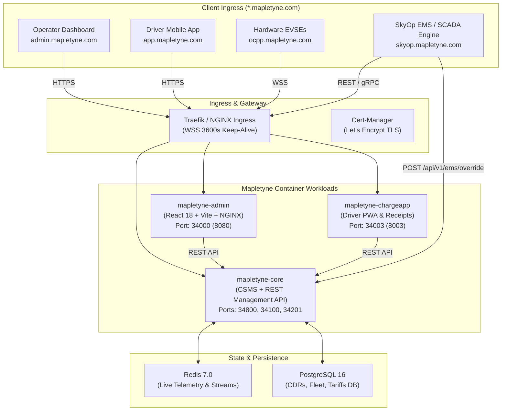

# Mapletyne CPO — System Architecture & Topology

## 1. High-Level Architecture Topology

The **Mapletyne CPO Platform** is built upon a 3-tier cloud-native architecture ensuring real-time hardware telemetry, protocol isolation, and dynamic energy management.

---

## 2. Workload Roles & Responsibilities

### 2.1 `mapletyne-core`
- **OCPP 1.6J & 2.0.1 Server**: Manages bidirectional WebSocket connections with EVSE field hardware.
- **Device Model & Diagnostics**: Inspects variables, component statuses, and firmware events.
- **REST Management API**: Powers the Operator Dashboard and Mobile Driver App.
- **Autonomous Self-Healing Watchdog**: Automatically initiates Tier 1 (UnlockCable) and Tier 2 (SoftReboot) recovery sequences upon anomaly detection.
- **External EMS Controller**: Ingests power curtailment and load setpoints from external SCADA systems (such as SkyOp EMS).

### 2.2 `mapletyne-admin`
- **CPO Operator Dashboard**: Single Page Application (SPA) built with React 18, Vite, and TailwindCSS.
- **Hardware Telemetry Oscilloscope**: Displays real-time 3-phase AC waveforms (L1/L2/L3 Volts & Amps) and active power gauges using custom `opencpo-dark` Apache ECharts theme.
- **Depot Fleet Cockpit**: Manages bay-level charging schedules, target departure times, vehicle SoC, and grid headroom.
- **On-Demand Inspection Drawers**: Provides detailed modals for Tariffs, Chargers, Sessions, Fleet Tokens, and OCPI Roaming.

### 2.3 `mapletyne-chargeapp`
- **Driver Mobile PWA**: Responsive mobile app for end-user charging session control.
- **Real-Time Metering Curve**: Displays live kW delivery and SoC % progress.
- **Digital Tax Invoices**: Generates automated VAT receipts with downloadable PDF receipts.
- **RFID & Virtual Wallet**: Manages corporate badge authorizations and payment methods.
