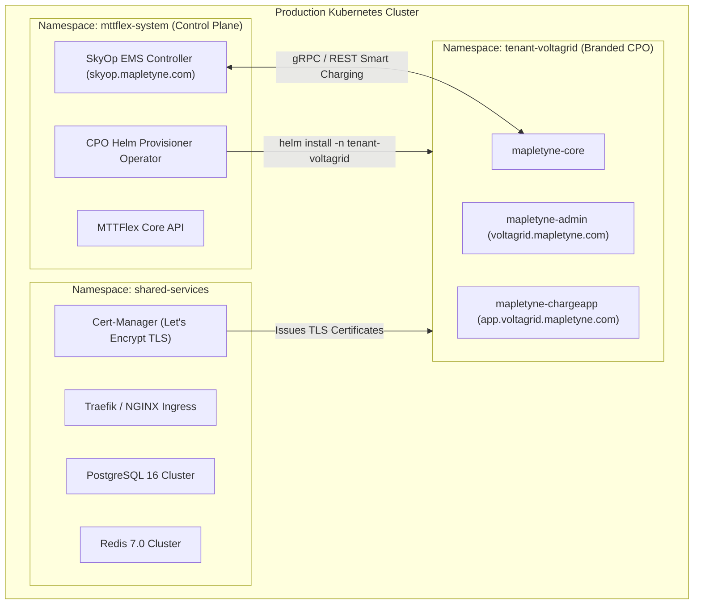

# Mapletyne CPO — Kubernetes & Multi-Tenant Helm Specification

*(Aligned with cluster infrastructure at `/applications/mttflex/services/kubernetes/`)*

## 1. Multi-Tenant Namespace Topology

Each provisioned CPO client runs inside an isolated namespace (`tenant-<slug>`) with dedicated resource limits and network policies:



---

## 2. Branded Helm `values.yaml` Template

```yaml
tenant:
  id: "voltagrid-uk"
  name: "VoltaGrid UK Charging"
  tier: "enterprise_flex"

branding:
  primaryColor: "#007aff"
  secondaryColor: "#0f172a"
  accentColor: "#10b981"
  logoUrl: "https://assets.mapletyne.com/tenants/voltagrid/logo.svg"
  faviconUrl: "https://assets.mapletyne.com/tenants/voltagrid/favicon.ico"
  supportEmail: "support@voltagrid.co.uk"

ingress:
  enabled: true
  className: "traefik"
  annotations:
    cert-manager.io/cluster-issuer: "letsencrypt-prod"
    traefik.ingress.kubernetes.io/router.entrypoints: "websecure"
    traefik.ingress.kubernetes.io/router.tls: "true"
    nginx.ingress.kubernetes.io/proxy-read-timeout: "3600"
    nginx.ingress.kubernetes.io/proxy-send-timeout: "3600"
  hosts:
    admin: "voltagrid.mapletyne.com"
    app: "app.voltagrid.mapletyne.com"
    ocpp: "ocpp.voltagrid.mapletyne.com"
  tls:
    - secretName: "voltagrid-tls-cert"
      hosts:
        - "voltagrid.mapletyne.com"
        - "app.voltagrid.mapletyne.com"
        - "ocpp.voltagrid.mapletyne.com"

mapletyneCore:
  replicaCount: 2
  image:
    repository: "registry.mapletyne.com/mapletyne/core"
    tag: "v2.4.2"
    pullPolicy: "IfNotPresent"
  resources:
    limits:
      cpu: "1500m"
      memory: "1024Mi"
    requests:
      cpu: "250m"
      memory: "256Mi"
  env:
    OCPP_PORT: "9000"
    OCPP_SUPPORTED_VERSIONS: "1.6J,2.0.1"
    EMS_GATEWAY_URL: "http://skyop-ems.mttflex-system.svc.cluster.local:8000"

mapletyneAdmin:
  replicaCount: 1
  image:
    repository: "registry.mapletyne.com/mapletyne/admin"
    tag: "v2.4.2"
  resources:
    limits:
      cpu: "300m"
      memory: "256Mi"

mapletyneChargeApp:
  replicaCount: 2
  image:
    repository: "registry.mapletyne.com/mapletyne/chargeapp"
    tag: "v2.4.2"
  resources:
    limits:
      cpu: "500m"
      memory: "512Mi"
```
