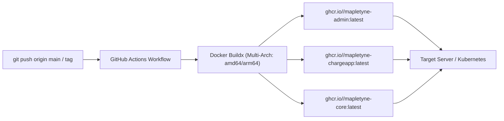

# Mapletyne CPO — GHCR Automation & Replicability Guide

**Author:** Winston (`🏛️`) — System Architect  
**Scope:** Automated GitHub Actions CI/CD $\rightarrow$ GitHub Container Registry (`ghcr.io`) $\rightarrow$ Zero-Install Server Deployment

---

## 1. Automated CI/CD Architecture (GitHub Actions)

When you push code or a version tag (`v*.*.*`) to GitHub, [`.github/workflows/docker-publish.yml`](file:///home/danielaroko/applications/opencpo/.github/workflows/docker-publish.yml) automatically triggers:



### Key Workflow Features
- **Multi-Architecture Support**: Built for both standard x86 servers (`linux/amd64`) and ARM-based servers / AWS Graviton (`linux/arm64`).
- **Zero Secrets Required for Publishing**: Uses GitHub's internal `${{ secrets.GITHUB_TOKEN }}` with `packages: write` permission.
- **Layer Caching**: Utilizes `type=gha` GitHub Actions cache to make subsequent builds under 60 seconds.

---

## 2. GitHub Repository Setup (One-Time)

To ensure the built packages can be pulled by your deployment servers:

1. **Push your code to GitHub**:
   ```bash
   git add .github/workflows/docker-publish.yml docker-compose.prod.yml
   git commit -m "feat(ci): add automated GHCR build & publish workflow"
   git push origin main
   ```
2. **Make Packages Public (Recommended for easiest replicability)**:
   - Navigate to your repository or organization on GitHub $\rightarrow$ **Packages** tab.
   - Click each package (`mapletyne-admin`, `mapletyne-chargeapp`, `mapletyne-core`).
   - Click **Package Settings** $\rightarrow$ Under **Danger Zone**, change visibility to **Public**.

*(Note: If packages are kept **Private**, servers authenticate once via `echo $CR_PAT | docker login ghcr.io -u <username> --password-stdin`).*

---

## 3. Universal Replicability: How to Deploy on Any Server

To replicate and run the entire CPO platform on any remote server (AWS, GCP, DigitalOcean, Hetzner, or on-premise edge hardware):

### Step 1: Download the Replicability Compose File
```bash
# Download the single production compose file
curl -O https://raw.githubusercontent.com/YOUR_ORG/YOUR_REPO/main/docker-compose.prod.yml
```

### Step 2: Configure Environment (Optional overrides)
```bash
# Create .env or export variables
export IMAGE_OWNER="your-github-org-or-username"
export POSTGRES_PASSWORD="your-db-password"
export MANAGEMENT_API_KEY="your-api-key"
```

### Step 3: Pull & Launch
```bash
# Pull the latest prebuilt images directly from GHCR
docker compose -f docker-compose.prod.yml pull

# Start all workloads detached
docker compose -f docker-compose.prod.yml up -d
```

### Step 4: Verify Deployment
- 🖥️ **Operator Dashboard**: `http://<SERVER_IP>:34000`
- 📱 **Driver Mobile PWA**: `http://<SERVER_IP>:34003`
- 🔌 **Core REST API & Prometheus Metrics**: `http://<SERVER_IP>:34800/metrics`
