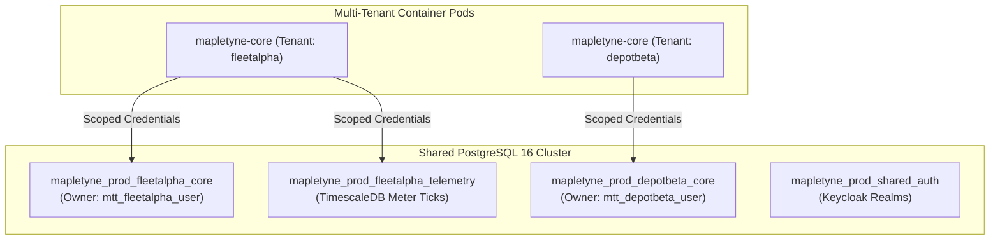

# Mapletyne CPO — Enterprise Database Tenancy & Naming Specification

**Specification Version:** 1.0.0 (Enterprise Gold Standard)  
**Author:** Winston (`🏛️`) — System Architect  
**Scope:** Multi-Tenant Database Isolation, Deterministic Naming Conventions, Redis Namespacing & Automated Provisioning

---

## 1. Executive Tenancy Architecture

In an enterprise Charge Point Operator (CPO) and Fleet Energy platform, multiple instances (tenants, fleets, depots, or environments) frequently run on the same infrastructure or shared database server.

Mapletyne CPO enforces **Model A: Database-per-Tenant Isolation**:



### Key Architectural Invariants
1. **Zero Data Contamination**: Logical database separation guarantees that queries, indices, and vacuum cycles for one tenant cannot leak or block another tenant's operations.
2. **Independent Point-in-Time Recovery**: Database-level snapshots (`pg_dump` / WAL archiving) allow individual tenants to be backed up, restored, or exported without affecting neighboring instances.
3. **Hardware Noise Isolation**: High-frequency OCPP 2.0.1 meter value traffic from a busy 100-bay depot will not degrade write throughput or lock tables in smaller fleet databases.
4. **Clean Offboarding**: Terminating a tenant instance is a non-destructive single command (`DROP DATABASE mapletyne_prod_<tenant>_core`).

---

## 2. Deterministic PostgreSQL Naming Convention

All PostgreSQL databases and database users must strictly conform to the **4-segment naming standard**:

$$\mathbf{\{platform\}\_\{\text{environment}\}\_\{\text{tenant\_slug}\}\_\{\text{domain}\}}$$

### 2.1 Segment Breakdown

| Segment | Allowed Values | Description | Example |
| :--- | :--- | :--- | :--- |
| **`platform`** | `mapletyne` | Global platform namespace identifier | `mapletyne` |
| **`environment`** | `prod`, `stage`, `dev`, `qa`, `test` | Target deployment tier | `prod` |
| **`tenant_slug`** | Lowercase alphanumeric + underscores | Unique tenant, fleet, or depot identifier | `fleetalpha`, `cityhub` |
| **`domain`** | `core`, `telemetry`, `auth`, `billing` | Functional domain separation | `core` |

### 2.2 Database Domain Matrix

| Database Suffix | Role & Data Contained | Storage Engine |
| :--- | :--- | :--- |
| **`..._core`** | Charging sessions, CDRs, RFID tokens, hardware EVSEs, tariffs, bays | Standard PostgreSQL (ACID) |
| **`..._telemetry`** | High-frequency raw 3-phase meter values, SoC curves, temperatures | TimescaleDB Hypertables |
| **`..._auth`** | Keycloak IAM users, driver credentials, OAuth2 client secrets | PostgreSQL / Keycloak |

### 2.3 Scoped Database User Naming

To enforce least-privilege security, each tenant database is owned by a dedicated database user:

$$\mathbf{\text{mtt}\_\{\text{tenant\_slug}\}\_\text{user}}$$

Example: `mtt_fleetalpha_user` has `ALL PRIVILEGES` only on `mapletyne_prod_fleetalpha_*` and zero access to other tenant databases.

---

## 3. Redis Hierarchical Key Namespacing

While PostgreSQL uses isolated databases, Redis streams and state caches share the cluster using **Hierarchical Colon Namespacing**:

$$\mathbf{\text{mtt}:\{\text{environment}\}:\{\text{tenant\_slug}\}:\{\text{resource}\}:\{\text{id}\}}$$

### Standard Key Schema

| Resource | Redis Key Pattern | Data Structure | TTL |
| :--- | :--- | :--- | :--- |
| **Active EVSE State** | `mtt:prod:fleetalpha:chargers:{evse_id}:state` | String / Hash | 60s (heartbeat refreshed) |
| **Active Transaction** | `mtt:prod:fleetalpha:sessions:{tx_id}:live` | Hash | While active |
| **Event Stream** | `mtt:prod:fleetalpha:events:stream` | Redis Stream (`XADD`) | 7-day retention |
| **EMS Dynamic Limit** | `mtt:prod:fleetalpha:ems:power_limit_kw` | String | 300s |
| **Idempotency Locks** | `mtt:prod:fleetalpha:locks:{action}:{id}` | String (`SET NX EX`) | 10s |

---

## 4. Automated Provisioning Blueprint

When a new system or tenant is spun up, the automated provisioning script creates the scoped user, database, and runs initial migrations.

### 4.1 Automated SQL Bootstrap (`provision_tenant.sql`)

```sql
-- 1. Create dedicated tenant user if not existing
DO $$
BEGIN
  IF NOT EXISTS (SELECT FROM pg_catalog.pg_roles WHERE rolname = 'mtt_fleetalpha_user') THEN
    CREATE USER mtt_fleetalpha_user WITH PASSWORD 'GENERATE_SECURE_PASSWORD_HERE';
  END IF;
END
$$;

-- 2. Create tenant core database with user ownership
CREATE DATABASE mapletyne_prod_fleetalpha_core 
  WITH OWNER = mtt_fleetalpha_user
  ENCODING = 'UTF8'
  LC_COLLATE = 'en_US.utf8'
  LC_CTYPE = 'en_US.utf8'
  CONNECTION LIMIT = 100;

-- 3. Grant scoped privileges
GRANT ALL PRIVILEGES ON DATABASE mapletyne_prod_fleetalpha_core TO mtt_fleetalpha_user;
```

### 4.2 Automated Runtime Injection (`.env` / Helm Values)

Each spin-up container is injected with its dedicated parameters:

```ini
# Instance Identity
ENVIRONMENT=prod
TENANT_SLUG=fleetalpha

# Database Connection (Isolated)
PG_HOST=postgres.mapletyne.internal
PG_PORT=5432
PG_NAME=mapletyne_prod_fleetalpha_core
PG_USER=mtt_fleetalpha_user
PG_PASSWORD=SECURE_GENERATED_PASSWORD

# Redis Namespacing
REDIS_HOST=redis.mapletyne.internal
REDIS_PORT=6379
REDIS_PREFIX=mtt:prod:fleetalpha
```
