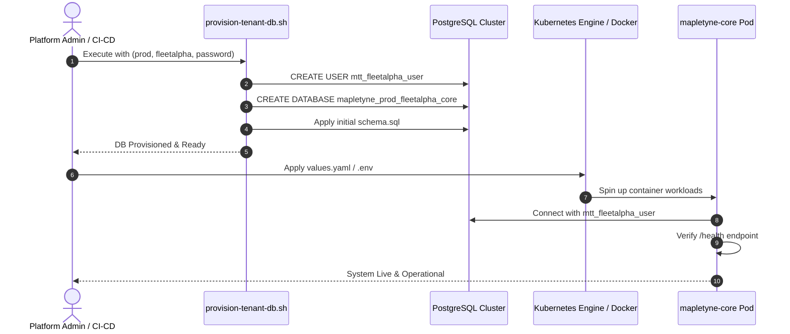

# Mapletyne CPO — Provisioning Parameters & Ingestion Formats

**Specification Version:** 1.0.0 (Enterprise Gold Standard)  
**Author:** Winston (`🏛️`) — System Architect  
**Scope:** Provisioning Parameter Dictionary, Kubernetes Helm `values.yaml`, Docker `.env`, and Automated JSON API Schemas

---

## 1. Master Parameter Dictionary

To spin up a new isolated Mapletyne CPO pod or cluster instance, the provisioning system requires parameters across **6 functional groups**:

| Parameter Key | Required? | Type | Example Value | Description |
| :--- | :---: | :---: | :--- | :--- |
| **`ENVIRONMENT`** | **Yes** | String | `prod` / `stage` / `dev` | Deployment environment tier |
| **`TENANT_SLUG`** | **Yes** | String | `fleetalpha` | Unique lowercase identifier (used in URLs, DB names, Redis keys) |
| **`TENANT_NAME`** | **Yes** | String | `Fleet Alpha Logistics` | Human-readable company/fleet name |
| **`BASE_DOMAIN`** | **Yes** | FQDN | `mapletyne.com` | Base domain for Ingress host routing |
| **`ADMIN_HOSTNAME`** | No | FQDN | `admin-fleetalpha.mapletyne.com` | Operator dashboard Ingress URL (defaults to `admin-<slug>.<base>`) |
| **`CHARGEAPP_HOSTNAME`** | No | FQDN | `app-fleetalpha.mapletyne.com` | Driver PWA Ingress URL (defaults to `app-<slug>.<base>`) |
| **`CORE_API_HOSTNAME`** | No | FQDN | `api-fleetalpha.mapletyne.com` | CSMS REST API Ingress URL (defaults to `api-<slug>.<base>`) |
| **`OCPP_WS_HOSTNAME`** | No | FQDN | `ocpp-fleetalpha.mapletyne.com` | Hardware EVSE WebSocket endpoint (defaults to `ocpp-<slug>.<base>`) |
| **`PG_HOST`** | **Yes** | String | `postgres.mapletyne.internal` | PostgreSQL server hostname |
| **`PG_PORT`** | No | Integer | `5432` | PostgreSQL port |
| **`PG_NAME`** | **Yes** | String | `mapletyne_prod_fleetalpha_core` | Dedicated isolated database name |
| **`PG_USER`** | **Yes** | String | `mtt_fleetalpha_user` | Dedicated database owner user |
| **`PG_PASSWORD`** | **Yes** | Secret | `s3cure_P@ssw0rd_2026!` | Scoped database user password |
| **`REDIS_HOST`** | **Yes** | String | `redis.mapletyne.internal` | Redis cluster hostname |
| **`REDIS_PORT`** | No | Integer | `6379` | Redis port |
| **`REDIS_PASSWORD`** | No | Secret | `redis_secret` | Redis authentication token (if enabled) |
| **`REDIS_PREFIX`** | **Yes** | String | `mtt:prod:fleetalpha` | Hierarchical stream & cache namespace prefix |
| **`SECRET_KEY`** | **Yes** | Secret | `64-char-hex-jwt-signing-secret` | High-entropy HMAC signing key for JWT tokens |
| **`MANAGEMENT_API_KEY`**| **Yes** | Secret | `mtt_sec_prod_fleetalpha_2026` | API key securing internal admin endpoints |
| **`APP_TITLE`** | No | String | `Alpha Fleet Charge` | Display title on the Driver PWA |
| **`SKIN`** | No | String | `modern-emerald` / `otaski` | Active UI theme (`modern-emerald`, `otaski`, `voltage-industrial`) |
| **`DEFAULT_LANG`** | No | String | `en` (`en`, `nl`, `de`, `fr`) | Default language localization |
| **`CURRENCY`** | No | String | `GBP` (`GBP`, `EUR`, `USD`) | Default currency code |
| **`TIMEZONE`** | No | String | `Europe/London` | Station operational timezone |

---

## 2. Format 1: Kubernetes / Helm `values.yaml` (Pod Provisioning)

Use this file when deploying an isolated pod/namespace to a Kubernetes cluster via Helm or GitOps (ArgoCD / Flux):

```yaml
# ── 1. Tenant & Environment Identity ─────────────────────────────────────────
tenant:
  slug: "fleetalpha"
  name: "Fleet Alpha Logistics"
  environment: "prod"

# ── 2. Ingress & Routing ─────────────────────────────────────────────────────
ingress:
  enabled: true
  className: "traefik"
  clusterIssuer: "letsencrypt-prod"
  baseDomain: "mapletyne.com"
  hosts:
    admin: "admin-fleetalpha.mapletyne.com"
    chargeApp: "app-fleetalpha.mapletyne.com"
    coreApi: "api-fleetalpha.mapletyne.com"
    ocppWs: "ocpp-fleetalpha.mapletyne.com"
  corsOrigins:
    - "https://admin-fleetalpha.mapletyne.com"
    - "https://app-fleetalpha.mapletyne.com"

# ── 3. Isolated Database & Redis Persistence ────────────────────────────────
database:
  host: "postgres-cluster.shared-services.svc.cluster.local"
  port: 5432
  name: "mapletyne_prod_fleetalpha_core"
  user: "mtt_fleetalpha_user"
  passwordSecretRef:
    name: "fleetalpha-db-credentials"
    key: "password"
  sslMode: "prefer"

redis:
  host: "redis-cluster.shared-services.svc.cluster.local"
  port: 6379
  prefix: "mtt:prod:fleetalpha"
  passwordSecretRef:
    name: "fleetalpha-redis-credentials"
    key: "password"

# ── 4. Security Keys & Secrets ───────────────────────────────────────────────
security:
  secretKeyRef:
    name: "fleetalpha-security-keys"
    key: "secret-key"
  managementApiKeyRef:
    name: "fleetalpha-security-keys"
    key: "management-api-key"

# ── 5. White-Label Branding & Localization ───────────────────────────────────
branding:
  appTitle: "Alpha Fleet Charge"
  skin: "modern-emerald"
  defaultLang: "en"
  currency: "GBP"
  timezone: "Europe/London"

# ── 6. Resource Quotas per Pod ───────────────────────────────────────────────
resources:
  core:
    requests: { cpu: "250m", memory: "256Mi" }
    limits: { cpu: "1500m", memory: "1024Mi" }
  admin:
    requests: { cpu: "50m", memory: "64Mi" }
    limits: { cpu: "500m", memory: "256Mi" }
  chargeApp:
    requests: { cpu: "100m", memory: "128Mi" }
    limits: { cpu: "500m", memory: "512Mi" }
```

---

## 3. Format 2: Docker Environment File (`.env`) (Single VM / Compose)

Use this format when provisioning a standalone instance or edge node via `docker compose -f docker-compose.prod.yml up -d`:

```ini
# ── Instance Parameters ──────────────────────────────────────────────────
ENVIRONMENT=prod
TENANT_SLUG=fleetalpha
ORG_NAME="Fleet Alpha Logistics"

# ── Image Registry ───────────────────────────────────────────────────────
IMAGE_REGISTRY=ghcr.io
IMAGE_OWNER=danielmtt9
IMAGE_TAG=latest

# ── Port Bindings (Host Allocation) ──────────────────────────────────────
ADMIN_PORT=34000
CHARGEAPP_PORT=34003
MANAGEMENT_API_PORT=34800
OCPP_16_WS_PORT=34100
OCPP_201_WS_PORT=34201

# ── Isolated Database (Model A) ──────────────────────────────────────────
PG_HOST=host.docker.internal
PG_PORT=5432
PG_NAME=mapletyne_prod_fleetalpha_core
PG_USER=mtt_fleetalpha_user
PG_PASSWORD=s3cure_P@ssw0rd_2026!

# ── Redis Stream Namespacing ─────────────────────────────────────────────
REDIS_HOST=redis
REDIS_PORT=6379
REDIS_PREFIX=mtt:prod:fleetalpha

# ── Security Secrets ─────────────────────────────────────────────────────
SECRET_KEY=e83a9f0293d8b3741a2938e74659281a0e9837461234567890abcdef12345678
MANAGEMENT_API_KEY=mtt_sec_prod_fleetalpha_2026

# ── Public Hostnames & CORS ──────────────────────────────────────────────
PUBLIC_URL=https://admin-fleetalpha.mapletyne.com
CHARGEAPP_URL=https://app-fleetalpha.mapletyne.com
CORE_API_PUBLIC_URL=https://api-fleetalpha.mapletyne.com
CORS_ORIGINS=https://admin-fleetalpha.mapletyne.com,https://app-fleetalpha.mapletyne.com

# ── Branding & Localization ──────────────────────────────────────────────
APP_TITLE="Alpha Fleet Charge"
SKIN=modern-emerald
DEFAULT_LANG=en
CURRENCY=GBP
TIMEZONE=Europe/London
```

---

## 4. Format 3: Automated JSON API Payload (REST / CI/CD)

Use this JSON schema when triggering automated provisioning via a platform orchestration API (`POST /api/v1/admin/tenants/provision`):

```json
{
  "tenant_slug": "fleetalpha",
  "tenant_name": "Fleet Alpha Logistics",
  "environment": "prod",
  "base_domain": "mapletyne.com",
  "database": {
    "host": "postgres.mapletyne.internal",
    "port": 5432,
    "name": "mapletyne_prod_fleetalpha_core",
    "user": "mtt_fleetalpha_user",
    "password": "s3cure_P@ssw0rd_2026!"
  },
  "redis": {
    "host": "redis.mapletyne.internal",
    "port": 6379,
    "prefix": "mtt:prod:fleetalpha"
  },
  "security": {
    "secret_key": "e83a9f0293d8b3741a2938e74659281a0e9837461234567890abcdef12345678",
    "management_api_key": "mtt_sec_prod_fleetalpha_2026"
  },
  "branding": {
    "app_title": "Alpha Fleet Charge",
    "skin": "modern-emerald",
    "default_lang": "en",
    "currency": "GBP",
    "timezone": "Europe/London"
  },
  "resources": {
    "cpu_limit": "2.0",
    "memory_limit": "1536Mi"
  }
}
```

---

## 5. End-to-End Provisioning Sequence


