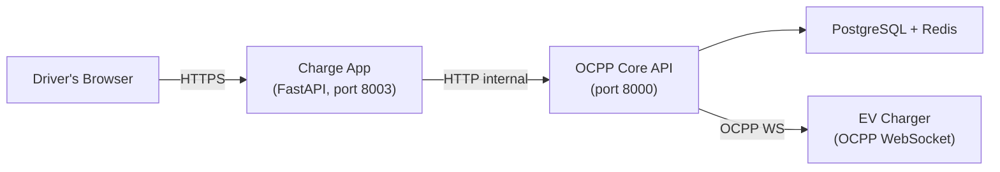

# Architecture

The charge app is a web-based PWA (Progressive Web App) for EV drivers to find chargers, start sessions, pay, and monitor charging. It runs in any browser and is installable on any phone.

## Two-Layer Design

```
┌─────────────────────────────────────────────┐
│  Skin Layer (branding, CSS, template overrides) │
│  └─ skins/default/    → base clean theme     │
│  └─ skins/my-brand/   → custom CSS/templates  │
├─────────────────────────────────────────────┤
│  Engine Layer (open-source, brand-agnostic)  │
│  ├─ Routes (home, charge, auth, session, receipt, qr)  │
│  ├─ Plugins (account, favorites, receipts)   │
│  ├─ Core (API proxy, feature flags, middleware) │
│  └─ Templates (base HTML, JS, service worker) │
└─────────────────────────────────────────────┘
```

**Engine** — the open-source core. Routes, API proxy, plugin loader, feature flags, service worker. Knows nothing about your brand.

**Skin** — branding overlay. CSS overrides, custom templates, logos, colors. Swap the skin, get a different-looking app with the same functionality.

## Data Flow



The charge app is a **thin proxy**. It:
- Proxies API calls to OCPP Core (`core/api.py`)
- Renders templates with data from Core API
- Reads feature flags from Core API (cached 10s)
- Serves static assets (skin CSS/JS)

The charge app **never**:
- Touches the database directly
- Sends OCPP commands directly
- Stores session state (it's stateless)

## Directory Structure

```
charge-app/
├── main.py                    App entry — route registration, plugin/skin loading
├── config.py                  Env-based config (CORE_API, SKIN, PLUGINS)
├── core/                      Engine internals
│   ├── api.py                 Thin HTTP proxy to OCPP Core API
│   ├── flags.py               Feature flag reader (cached from Core API)
│   └── middleware.py          Request context injection (flags, skin, auth, i18n)
├── routes/                    Base routes (one file per flow)
│   ├── home.py                Map + charger discovery
│   ├── qr.py                  QR sticker landing + redirect
│   ├── charge.py              Charger detail + connector picker
│   ├── auth.py                OTP phone verification
│   ├── session.py             Live session monitoring + stop
│   ├── receipt.py             Receipt screen + PDF download
│   └── push.py                Push notification subscription
├── plugins/                   Feature modules (self-contained)
│   ├── __init__.py            Plugin auto-discovery
│   ├── account/               Login, registration, profile, history
│   ├── favorites/             Saved chargers (localStorage + server sync)
│   └── receipts/              PDF receipt generation (mandatory)
├── templates/                 Base templates (engine default)
│   ├── base.html              Shell — loads skin CSS, injects flags
│   ├── home.html              Map screen
│   ├── charge.html            Charger detail
│   ├── auth.html              Phone verification
│   ├── session.html           Live session view
│   ├── receipt.html           Receipt screen
│   └── error.html             Error page
├── static/                    Base static assets
│   ├── home.js                Map + discovery JS
│   ├── htmx.min.js            HTMX for partial page updates
│   ├── style.css              Base CSS (fallback)
│   ├── manifest.json          PWA manifest
│   └── sw.js                  Service worker
└── skins/                     Skin overrides
    └── default/               Clean functional theme
        ├── skin.json           Colors, logo, metadata
        └── static/style.css   Full CSS override
```

## Template Resolution

Templates are resolved in this order:
1. `skins/{SKIN}/templates/` — skin-specific overrides
2. `plugins/{name}/templates/` — plugin templates
3. `templates/` — base engine templates

A skin can override any template by placing a file with the same name in its `templates/` directory.

## Middleware Pipeline

Every request passes through `inject_context` middleware which sets:

| `request.state` field | Source | Description |
|---|---|---|
| `flags` | Core API `/api/v1/features` | Feature flags (cached 10s) |
| `skin` | `SKIN` env var | Current skin name |
| `account` | JWT cookie `auth_token` | Decoded account payload (or None) |
| `lang` | Cookie → query param → default `nl` | Language code |
| `t` | `static/i18n.json` | Translation dict for current language |

## No File Over 500 Lines

This is a hard constraint. Each route file handles one user flow. JS is in static files. CSS is in the skin directory. Plugins are self-contained.
