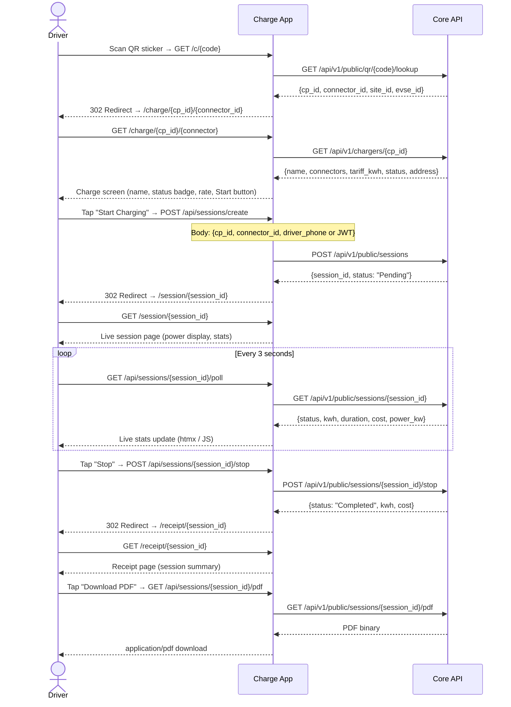
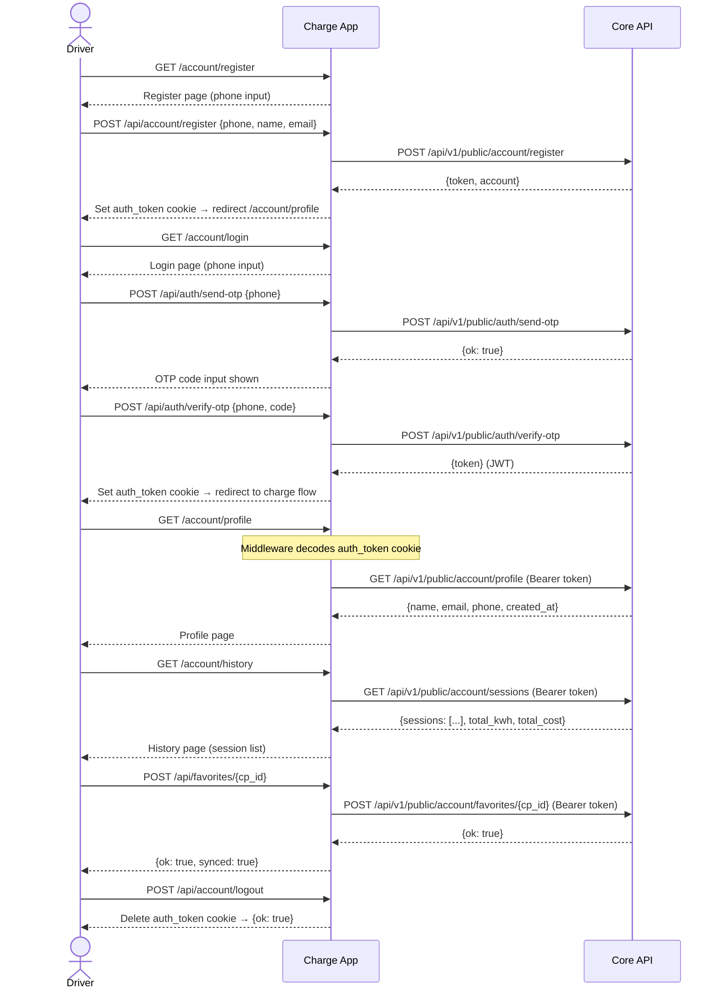
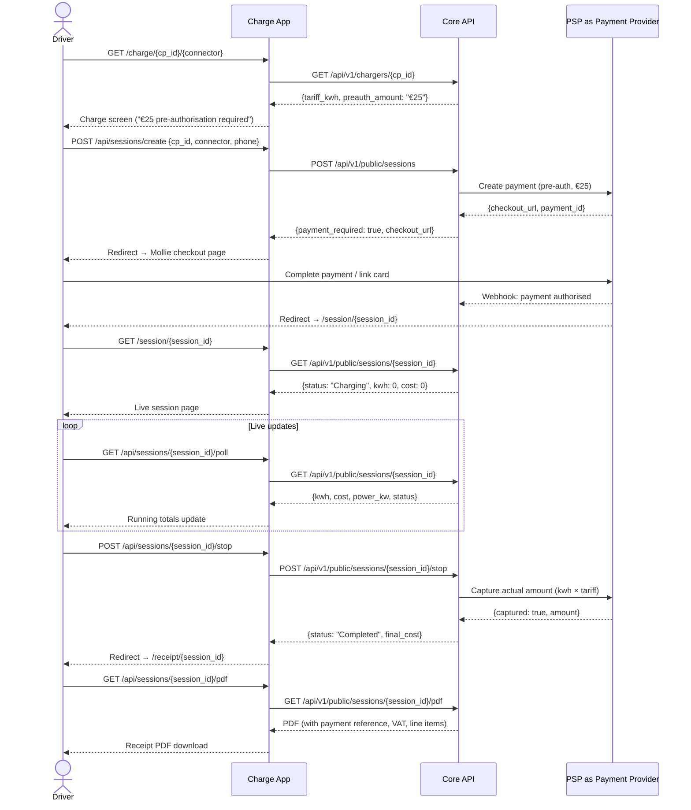

# User Flows

This document describes the main user journeys through the charge app, with sequence diagrams for each.

---

## 1. QR Scan → Charge → Receipt

The primary flow. An EV driver scans a QR sticker on a charger, starts a charging session, monitors it live, stops it, and downloads a receipt.



### Key Routes

| Step | Route | Method |
|---|---|---|
| QR landing | `/c/{code}` | GET |
| Charger screen | `/charge/{cp_id}/{connector}` | GET |
| Create session | `/api/sessions/create` | POST |
| Live session | `/session/{session_id}` | GET |
| Poll status | `/api/sessions/{session_id}/poll` | GET |
| Stop session | `/api/sessions/{session_id}/stop` | POST |
| Receipt screen | `/receipt/{session_id}` | GET |
| Download PDF | `/api/sessions/{session_id}/pdf` | GET |

---

## 2. Account Flow

Drivers can register with a phone number (OTP), log in, view their charging history, and manage favorites.



### Notes

- The `auth_token` cookie is HttpOnly and set with `SameSite=Lax`. Middleware decodes it on every request and populates `request.state.account`.
- If the JWT is expired or invalid, `request.state.account` is `None` and routes that require auth redirect to `/account/login`.
- Favorites also work without an account (localStorage-only). The server sync is additive when logged in.

---

## 3. Payment Flow

When payment is enabled (via feature flags), the flow includes a pre-authorization step via Mollie before the session starts.



> **Note:** Mollie is the reference PSP implementation. Any payment provider can be integrated via Core API — the charge app only handles the redirect and webhook confirmation.

### Payment Feature Flag

Payment enforcement is controlled by a feature flag returned from Core API:

```json
{
  "flags": {
    "payment_required": true,
    "preauth_amount_eur": 25
  }
}
```

Templates check `flags.payment_required` to show or hide payment UI elements. The pre-authorisation amount is shown on the charge screen as a note before the driver starts.

### Session States

```
Pending → Preparing → Charging → Stopping → Completed
                                           ↘ Cancelled
```

- **Pending**: Session created, payment pending (if applicable)
- **Preparing**: Payment authorised, charger preparing
- **Charging**: Active charge in progress
- **Stopping**: Stop command sent, session wrapping up
- **Completed**: Session ended, final values recorded
- **Cancelled**: Session cancelled before charging started (no charge)
